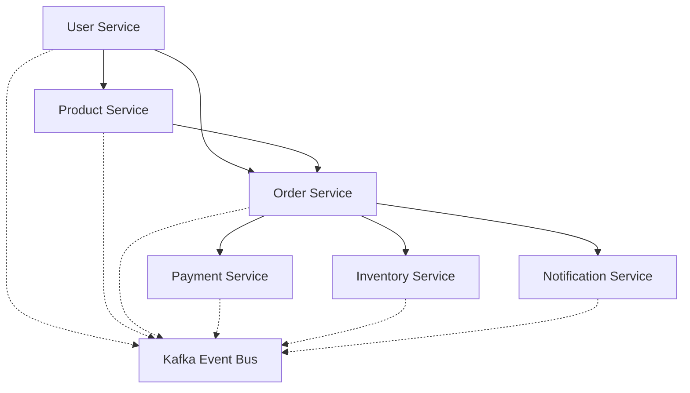
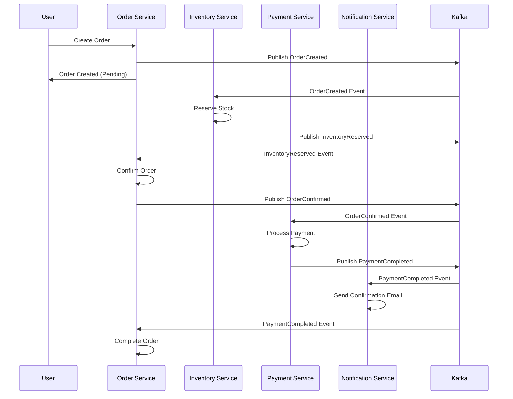

# Kafka 기반 이벤트 소싱 마이크로서비스 연동 실전 예시

## 목차
1. [프로젝트 개요](#프로젝트-개요)
2. [서비스 분할 전략](#서비스-분할-전략)
3. [Kafka 토픽 설계](#kafka-토픽-설계)
4. [이벤트 소싱 구현](#이벤트-소싱-구현)
5. [서비스별 구현 예시](#서비스별-구현-예시)
6. [서비스 간 연동 시나리오](#서비스-간-연동-시나리오)
7. [프로젝트 구조](#프로젝트-구조)
8. [운영 고려사항](#운영-고려사항)

## 프로젝트 개요

### 대상 시스템: 간단한 온라인 쇼핑몰
- **규모**: 소규모 스타트업 수준
- **예상 트래픽**: 일일 주문 1,000건 미만
- **핵심 기능**: 사용자 관리, 상품 관리, 주문 처리, 결제, 알림

### 기술 스택
- **Language**: Java 17
- **Framework**: Spring Boot 3.2
- **Message Broker**: Apache Kafka 3.5
- **Database**: PostgreSQL (Write), MongoDB (Read)
- **Cache**: Redis
- **Container**: Docker, Docker Compose

## 서비스 분할 전략

### 도메인 기반 서비스 분할



### 1. User Service (사용자 서비스)
**책임:**
- 사용자 등록/인증/권한 관리
- 프로필 관리
- 사용자 활동 이벤트 발행

**포트:** 8081

### 2. Product Service (상품 서비스)
**책임:**
- 상품 정보 관리 (CRUD)
- 상품 카테고리 관리
- 상품 조회 최적화

**포트:** 8082

### 3. Order Service (주문 서비스)
**책임:**
- 주문 생성/수정/취소
- 주문 상태 관리
- 주문 이벤트 오케스트레이션

**포트:** 8083

### 4. Payment Service (결제 서비스)
**책임:**
- 결제 처리
- 결제 상태 관리
- 결제 이벤트 발행

**포트:** 8084

### 5. Inventory Service (재고 서비스)
**책임:**
- 재고 수량 관리
- 재고 예약/해제
- 재고 부족 알림

**포트:** 8085

### 6. Notification Service (알림 서비스)
**책임:**
- 이메일/SMS 발송
- 푸시 알림
- 알림 이력 관리

**포트:** 8086

## Kafka 토픽 설계

### 토픽 명명 규칙
- **패턴**: `{domain}.{entity}.{action}`
- **예시**: `user.profile.created`, `order.payment.completed`

### 주요 토픽 구성

```yaml
# 사용자 관련 이벤트
user.profile.created:
  partitions: 3
  replication-factor: 2
  
user.profile.updated:
  partitions: 3
  replication-factor: 2

# 상품 관련 이벤트  
product.catalog.created:
  partitions: 3
  replication-factor: 2
  
product.catalog.updated:
  partitions: 3
  replication-factor: 2

# 주문 관련 이벤트
order.lifecycle.created:
  partitions: 5
  replication-factor: 2
  
order.lifecycle.confirmed:
  partitions: 5
  replication-factor: 2
  
order.lifecycle.cancelled:
  partitions: 5
  replication-factor: 2

# 결제 관련 이벤트
payment.transaction.initiated:
  partitions: 3
  replication-factor: 2
  
payment.transaction.completed:
  partitions: 3
  replication-factor: 2
  
payment.transaction.failed:
  partitions: 3
  replication-factor: 2

# 재고 관련 이벤트
inventory.stock.reserved:
  partitions: 3
  replication-factor: 2
  
inventory.stock.released:
  partitions: 3
  replication-factor: 2
  
inventory.stock.depleted:
  partitions: 3
  replication-factor: 2

# 알림 관련 이벤트
notification.email.requested:
  partitions: 2
  replication-factor: 2
  
notification.sms.requested:
  partitions: 2
  replication-factor: 2
```

## 이벤트 소싱 구현

### 공통 이벤트 구조

```java
// 기본 이벤트 클래스
@JsonTypeInfo(use = JsonTypeInfo.Id.NAME, property = "eventType")
@JsonSubTypes({
    @JsonSubTypes.Type(value = UserCreatedEvent.class, name = "UserCreated"),
    @JsonSubTypes.Type(value = OrderCreatedEvent.class, name = "OrderCreated"),
    @JsonSubTypes.Type(value = PaymentCompletedEvent.class, name = "PaymentCompleted")
})
public abstract class DomainEvent {
    private String eventId;
    private String aggregateId;
    private LocalDateTime timestamp;
    private String eventType;
    private Integer version;
    
    // constructors, getters, setters
}

// 이벤트 스토어 엔티티
@Entity
@Table(name = "event_store")
public class EventStore {
    @Id
    private String eventId;
    
    @Column(nullable = false)
    private String aggregateId;
    
    @Column(nullable = false)
    private String eventType;
    
    @Column(columnDefinition = "TEXT")
    private String eventData;
    
    @Column(nullable = false)
    private LocalDateTime timestamp;
    
    @Column(nullable = false)
    private Integer version;
    
    // constructors, getters, setters
}

// 이벤트 스토어 Repository
@Repository
public interface EventStoreRepository extends JpaRepository<EventStore, String> {
    List<EventStore> findByAggregateIdOrderByVersionAsc(String aggregateId);
    
    @Query("SELECT e FROM EventStore e WHERE e.timestamp BETWEEN :start AND :end")
    List<EventStore> findEventsByTimeRange(
        @Param("start") LocalDateTime start, 
        @Param("end") LocalDateTime end
    );
}
```

### 이벤트 발행 및 저장 서비스

```java
@Service
@Transactional
public class EventSourcingService {
    
    private final EventStoreRepository eventStoreRepository;
    private final KafkaTemplate<String, Object> kafkaTemplate;
    private final ObjectMapper objectMapper;
    
    public void saveAndPublishEvent(DomainEvent event, String topicName) {
        try {
            // 1. 이벤트 스토어에 저장
            EventStore eventStore = new EventStore();
            eventStore.setEventId(event.getEventId());
            eventStore.setAggregateId(event.getAggregateId());
            eventStore.setEventType(event.getEventType());
            eventStore.setEventData(objectMapper.writeValueAsString(event));
            eventStore.setTimestamp(event.getTimestamp());
            eventStore.setVersion(event.getVersion());
            
            eventStoreRepository.save(eventStore);
            
            // 2. Kafka로 이벤트 발행
            kafkaTemplate.send(topicName, event.getAggregateId(), event)
                .whenComplete((result, ex) -> {
                    if (ex != null) {
                        log.error("Failed to publish event: {}", event.getEventId(), ex);
                        // 실패 처리 로직 (Outbox 패턴 등)
                    } else {
                        log.info("Successfully published event: {}", event.getEventId());
                    }
                });
                
        } catch (Exception e) {
            log.error("Failed to save and publish event: {}", event.getEventId(), e);
            throw new EventProcessingException("Failed to process event", e);
        }
    }
    
    public List<DomainEvent> getEventsByAggregateId(String aggregateId) {
        List<EventStore> eventStores = eventStoreRepository
            .findByAggregateIdOrderByVersionAsc(aggregateId);
            
        return eventStores.stream()
            .map(this::deserializeEvent)
            .collect(Collectors.toList());
    }
    
    private DomainEvent deserializeEvent(EventStore eventStore) {
        try {
            return objectMapper.readValue(eventStore.getEventData(), DomainEvent.class);
        } catch (Exception e) {
            throw new EventProcessingException("Failed to deserialize event", e);
        }
    }
}
```

## 서비스별 구현 예시

### 1. User Service 구현

```java
// 사용자 생성 이벤트
public class UserCreatedEvent extends DomainEvent {
    private String userId;
    private String email;
    private String name;
    private LocalDateTime createdAt;
    
    // constructors, getters, setters
}

// 사용자 서비스
@RestController
@RequestMapping("/api/users")
public class UserController {
    
    private final UserService userService;
    
    @PostMapping
    public ResponseEntity<UserResponse> createUser(@RequestBody CreateUserRequest request) {
        User user = userService.createUser(request);
        return ResponseEntity.ok(UserResponse.from(user));
    }
}

@Service
public class UserService {
    
    private final UserRepository userRepository;
    private final EventSourcingService eventSourcingService;
    
    public User createUser(CreateUserRequest request) {
        // 1. 사용자 생성
        User user = User.builder()
            .id(UUID.randomUUID().toString())
            .email(request.getEmail())
            .name(request.getName())
            .createdAt(LocalDateTime.now())
            .build();
            
        userRepository.save(user);
        
        // 2. 이벤트 생성 및 발행
        UserCreatedEvent event = UserCreatedEvent.builder()
            .eventId(UUID.randomUUID().toString())
            .aggregateId(user.getId())
            .userId(user.getId())
            .email(user.getEmail())
            .name(user.getName())
            .createdAt(user.getCreatedAt())
            .timestamp(LocalDateTime.now())
            .eventType("UserCreated")
            .version(1)
            .build();
            
        eventSourcingService.saveAndPublishEvent(event, "user.profile.created");
        
        return user;
    }
}
```

### 2. Order Service 구현

```java
// 주문 생성 이벤트
public class OrderCreatedEvent extends DomainEvent {
    private String orderId;
    private String userId;
    private List<OrderItem> items;
    private BigDecimal totalAmount;
    private LocalDateTime createdAt;
    
    // constructors, getters, setters
}

// 주문 확정 이벤트
public class OrderConfirmedEvent extends DomainEvent {
    private String orderId;
    private String userId;
    private BigDecimal totalAmount;
    private LocalDateTime confirmedAt;
    
    // constructors, getters, setters
}

// 주문 서비스
@Service
public class OrderService {
    
    private final OrderRepository orderRepository;
    private final EventSourcingService eventSourcingService;
    
    public Order createOrder(CreateOrderRequest request) {
        // 1. 주문 생성
        Order order = Order.builder()
            .id(UUID.randomUUID().toString())
            .userId(request.getUserId())
            .items(request.getItems())
            .totalAmount(calculateTotalAmount(request.getItems()))
            .status(OrderStatus.CREATED)
            .createdAt(LocalDateTime.now())
            .build();
            
        orderRepository.save(order);
        
        // 2. 주문 생성 이벤트 발행
        OrderCreatedEvent event = OrderCreatedEvent.builder()
            .eventId(UUID.randomUUID().toString())
            .aggregateId(order.getId())
            .orderId(order.getId())
            .userId(order.getUserId())
            .items(order.getItems())
            .totalAmount(order.getTotalAmount())
            .createdAt(order.getCreatedAt())
            .timestamp(LocalDateTime.now())
            .eventType("OrderCreated")
            .version(1)
            .build();
            
        eventSourcingService.saveAndPublishEvent(event, "order.lifecycle.created");
        
        return order;
    }
    
    // 재고 예약 성공 시 주문 확정
    @KafkaListener(topics = "inventory.stock.reserved")
    public void handleStockReserved(InventoryReservedEvent event) {
        if (event.getStatus() == ReservationStatus.SUCCESS) {
            confirmOrder(event.getOrderId());
        }
    }
    
    private void confirmOrder(String orderId) {
        Order order = orderRepository.findById(orderId)
            .orElseThrow(() -> new OrderNotFoundException("Order not found: " + orderId));
            
        order.confirm();
        orderRepository.save(order);
        
        // 주문 확정 이벤트 발행
        OrderConfirmedEvent event = OrderConfirmedEvent.builder()
            .eventId(UUID.randomUUID().toString())
            .aggregateId(orderId)
            .orderId(orderId)
            .userId(order.getUserId())
            .totalAmount(order.getTotalAmount())
            .confirmedAt(LocalDateTime.now())
            .timestamp(LocalDateTime.now())
            .eventType("OrderConfirmed")
            .version(order.getVersion() + 1)
            .build();
            
        eventSourcingService.saveAndPublishEvent(event, "order.lifecycle.confirmed");
    }
}
```

### 3. Inventory Service 구현

```java
// 재고 예약 이벤트
public class InventoryReservedEvent extends DomainEvent {
    private String orderId;
    private String productId;
    private Integer quantity;
    private ReservationStatus status;
    private String reason;
    
    // constructors, getters, setters
}

// 재고 서비스
@Service
public class InventoryService {
    
    private final InventoryRepository inventoryRepository;
    private final EventSourcingService eventSourcingService;
    
    // 주문 생성 시 재고 예약
    @KafkaListener(topics = "order.lifecycle.created")
    public void handleOrderCreated(OrderCreatedEvent event) {
        for (OrderItem item : event.getItems()) {
            reserveStock(event.getOrderId(), item.getProductId(), item.getQuantity());
        }
    }
    
    private void reserveStock(String orderId, String productId, Integer quantity) {
        Inventory inventory = inventoryRepository.findByProductId(productId)
            .orElseThrow(() -> new ProductNotFoundException("Product not found: " + productId));
            
        ReservationStatus status;
        String reason = null;
        
        if (inventory.getAvailableQuantity() >= quantity) {
            inventory.reserve(quantity);
            inventoryRepository.save(inventory);
            status = ReservationStatus.SUCCESS;
        } else {
            status = ReservationStatus.INSUFFICIENT_STOCK;
            reason = "Available: " + inventory.getAvailableQuantity() + ", Requested: " + quantity;
        }
        
        // 재고 예약 결과 이벤트 발행
        InventoryReservedEvent event = InventoryReservedEvent.builder()
            .eventId(UUID.randomUUID().toString())
            .aggregateId(productId)
            .orderId(orderId)
            .productId(productId)
            .quantity(quantity)
            .status(status)
            .reason(reason)
            .timestamp(LocalDateTime.now())
            .eventType("InventoryReserved")
            .version(1)
            .build();
            
        eventSourcingService.saveAndPublishEvent(event, "inventory.stock.reserved");
    }
}
```

### 4. Payment Service 구현

```java
// 결제 완료 이벤트
public class PaymentCompletedEvent extends DomainEvent {
    private String paymentId;
    private String orderId;
    private String userId;
    private BigDecimal amount;
    private PaymentStatus status;
    private String paymentMethod;
    private LocalDateTime completedAt;
    
    // constructors, getters, setters
}

// 결제 서비스
@Service
public class PaymentService {
    
    private final PaymentRepository paymentRepository;
    private final EventSourcingService eventSourcingService;
    private final ExternalPaymentGateway paymentGateway;
    
    // 주문 확정 시 결제 처리
    @KafkaListener(topics = "order.lifecycle.confirmed")
    public void handleOrderConfirmed(OrderConfirmedEvent event) {
        processPayment(event.getOrderId(), event.getUserId(), event.getTotalAmount());
    }
    
    private void processPayment(String orderId, String userId, BigDecimal amount) {
        try {
            // 1. 결제 정보 생성
            Payment payment = Payment.builder()
                .id(UUID.randomUUID().toString())
                .orderId(orderId)
                .userId(userId)
                .amount(amount)
                .status(PaymentStatus.PROCESSING)
                .createdAt(LocalDateTime.now())
                .build();
                
            paymentRepository.save(payment);
            
            // 2. 외부 결제 게이트웨이 호출
            PaymentResult result = paymentGateway.processPayment(payment);
            
            // 3. 결제 상태 업데이트
            payment.updateStatus(result.getStatus());
            payment.setCompletedAt(LocalDateTime.now());
            paymentRepository.save(payment);
            
            // 4. 결제 완료 이벤트 발행
            PaymentCompletedEvent event = PaymentCompletedEvent.builder()
                .eventId(UUID.randomUUID().toString())
                .aggregateId(payment.getId())
                .paymentId(payment.getId())
                .orderId(orderId)
                .userId(userId)
                .amount(amount)
                .status(result.getStatus())
                .paymentMethod(result.getPaymentMethod())
                .completedAt(payment.getCompletedAt())
                .timestamp(LocalDateTime.now())
                .eventType("PaymentCompleted")
                .version(1)
                .build();
                
            eventSourcingService.saveAndPublishEvent(event, "payment.transaction.completed");
            
        } catch (Exception e) {
            log.error("Payment processing failed for order: {}", orderId, e);
            handlePaymentFailure(orderId, e.getMessage());
        }
    }
}
```

### 5. Notification Service 구현

```java
// 알림 요청 이벤트
public class NotificationRequestedEvent extends DomainEvent {
    private String userId;
    private NotificationType type;
    private String subject;
    private String content;
    private Map<String, Object> templateData;
    
    // constructors, getters, setters
}

// 알림 서비스
@Service
public class NotificationService {
    
    private final EmailService emailService;
    private final EventSourcingService eventSourcingService;
    
    // 사용자 생성 시 환영 이메일 발송
    @KafkaListener(topics = "user.profile.created")
    public void handleUserCreated(UserCreatedEvent event) {
        sendWelcomeEmail(event.getUserId(), event.getEmail(), event.getName());
    }
    
    // 결제 완료 시 알림 발송
    @KafkaListener(topics = "payment.transaction.completed")
    public void handlePaymentCompleted(PaymentCompletedEvent event) {
        if (event.getStatus() == PaymentStatus.SUCCESS) {
            sendPaymentConfirmationEmail(event.getUserId(), event.getOrderId(), event.getAmount());
        }
    }
    
    private void sendWelcomeEmail(String userId, String email, String name) {
        Map<String, Object> templateData = Map.of(
            "name", name,
            "email", email
        );
        
        NotificationRequestedEvent event = NotificationRequestedEvent.builder()
            .eventId(UUID.randomUUID().toString())
            .aggregateId(userId)
            .userId(userId)
            .type(NotificationType.EMAIL)
            .subject("Welcome to Our Store!")
            .content("welcome-email-template")
            .templateData(templateData)
            .timestamp(LocalDateTime.now())
            .eventType("NotificationRequested")
            .version(1)
            .build();
            
        eventSourcingService.saveAndPublishEvent(event, "notification.email.requested");
        
        // 실제 이메일 발송
        emailService.sendWelcomeEmail(email, name);
    }
}
```

## 서비스 간 연동 시나리오

### 주문 처리 플로우 (Saga Pattern)



### 오류 처리 및 보상 트랜잭션

```java
@Component
public class OrderSagaOrchestrator {
    
    private final EventSourcingService eventSourcingService;
    
    // 재고 부족 시 주문 취소
    @KafkaListener(topics = "inventory.stock.reserved")
    public void handleInventoryReservationResult(InventoryReservedEvent event) {
        if (event.getStatus() == ReservationStatus.INSUFFICIENT_STOCK) {
            cancelOrder(event.getOrderId(), "Insufficient stock: " + event.getReason());
        }
    }
    
    // 결제 실패 시 재고 해제 및 주문 취소
    @KafkaListener(topics = "payment.transaction.completed")
    public void handlePaymentResult(PaymentCompletedEvent event) {
        if (event.getStatus() == PaymentStatus.FAILED) {
            releaseStock(event.getOrderId());
            cancelOrder(event.getOrderId(), "Payment failed");
        }
    }
    
    private void cancelOrder(String orderId, String reason) {
        OrderCancelledEvent event = OrderCancelledEvent.builder()
            .eventId(UUID.randomUUID().toString())
            .aggregateId(orderId)
            .orderId(orderId)
            .reason(reason)
            .cancelledAt(LocalDateTime.now())
            .timestamp(LocalDateTime.now())
            .eventType("OrderCancelled")
            .version(1)
            .build();
            
        eventSourcingService.saveAndPublishEvent(event, "order.lifecycle.cancelled");
    }
    
    private void releaseStock(String orderId) {
        StockReleaseRequestedEvent event = StockReleaseRequestedEvent.builder()
            .eventId(UUID.randomUUID().toString())
            .aggregateId(orderId)
            .orderId(orderId)
            .timestamp(LocalDateTime.now())
            .eventType("StockReleaseRequested")
            .version(1)
            .build();
            
        eventSourcingService.saveAndPublishEvent(event, "inventory.stock.release.requested");
    }
}
```

## 프로젝트 구조

### Docker Compose 구성

```yaml
version: '3.8'
services:
  # Kafka Infrastructure
  zookeeper:
    image: confluentinc/cp-zookeeper:7.4.0
    environment:
      ZOOKEEPER_CLIENT_PORT: 2181
      ZOOKEEPER_TICK_TIME: 2000
    ports:
      - "2181:2181"
      
  kafka:
    image: confluentinc/cp-kafka:7.4.0
    depends_on:
      - zookeeper
    ports:
      - "9092:9092"
    environment:
      KAFKA_BROKER_ID: 1
      KAFKA_ZOOKEEPER_CONNECT: zookeeper:2181
      KAFKA_ADVERTISED_LISTENERS: PLAINTEXT://localhost:9092
      KAFKA_OFFSETS_TOPIC_REPLICATION_FACTOR: 1
      
  # Databases
  postgres:
    image: postgres:15
    environment:
      POSTGRES_DB: ecommerce
      POSTGRES_USER: admin
      POSTGRES_PASSWORD: password
    ports:
      - "5432:5432"
    volumes:
      - postgres_data:/var/lib/postgresql/data
      
  mongodb:
    image: mongo:6.0
    ports:
      - "27017:27017"
    volumes:
      - mongo_data:/data/db
      
  redis:
    image: redis:7-alpine
    ports:
      - "6379:6379"
      
  # Microservices
  user-service:
    build: ./user-service
    ports:
      - "8081:8081"
    depends_on:
      - postgres
      - kafka
    environment:
      SPRING_PROFILES_ACTIVE: docker
      
  product-service:
    build: ./product-service
    ports:
      - "8082:8082"
    depends_on:
      - postgres
      - kafka
    environment:
      SPRING_PROFILES_ACTIVE: docker
      
  order-service:
    build: ./order-service
    ports:
      - "8083:8083"
    depends_on:
      - postgres
      - kafka
    environment:
      SPRING_PROFILES_ACTIVE: docker
      
  payment-service:
    build: ./payment-service
    ports:
      - "8084:8084"
    depends_on:
      - postgres
      - kafka
    environment:
      SPRING_PROFILES_ACTIVE: docker
      
  inventory-service:
    build: ./inventory-service
    ports:
      - "8085:8085"
    depends_on:
      - postgres
      - kafka
    environment:
      SPRING_PROFILES_ACTIVE: docker
      
  notification-service:
    build: ./notification-service
    ports:
      - "8086:8086"
    depends_on:
      - mongodb
      - kafka
    environment:
      SPRING_PROFILES_ACTIVE: docker

volumes:
  postgres_data:
  mongo_data:
```

### 공통 라이브러리 구성

```gradle
// shared-events/build.gradle
dependencies {
    implementation 'org.springframework.boot:spring-boot-starter'
    implementation 'com.fasterxml.jackson.core:jackson-annotations'
    implementation 'com.fasterxml.jackson.core:jackson-databind'
}

// 각 서비스의 build.gradle
dependencies {
    implementation 'org.springframework.boot:spring-boot-starter-web'
    implementation 'org.springframework.boot:spring-boot-starter-data-jpa'
    implementation 'org.springframework.kafka:spring-kafka'
    implementation project(':shared-events')
    
    runtimeOnly 'org.postgresql:postgresql'
}
```

### 프로젝트 디렉토리 구조

```
msa-ecommerce/
├── shared-events/
│   └── src/main/java/com/example/events/
│       ├── DomainEvent.java
│       ├── UserCreatedEvent.java
│       ├── OrderCreatedEvent.java
│       └── PaymentCompletedEvent.java
├── user-service/
│   ├── src/main/java/com/example/user/
│   ├── Dockerfile
│   └── build.gradle
├── order-service/
│   ├── src/main/java/com/example/order/
│   ├── Dockerfile
│   └── build.gradle
├── payment-service/
│   ├── src/main/java/com/example/payment/
│   ├── Dockerfile
│   └── build.gradle
├── inventory-service/
│   ├── src/main/java/com/example/inventory/
│   ├── Dockerfile
│   └── build.gradle
├── notification-service/
│   ├── src/main/java/com/example/notification/
│   ├── Dockerfile
│   └── build.gradle
├── docker-compose.yml
├── build.gradle
└── settings.gradle
```

## 운영 고려사항

### 1. 모니터링 설정

```yaml
# application-docker.yml (모든 서비스 공통)
management:
  endpoints:
    web:
      exposure:
        include: health,info,metrics,prometheus
  metrics:
    export:
      prometheus:
        enabled: true
    tags:
      service: ${spring.application.name}
      environment: ${spring.profiles.active}

logging:
  pattern:
    console: "%d{yyyy-MM-dd HH:mm:ss} [%thread] %-5level [%X{traceId},%X{spanId}] %logger{36} - %msg%n"
  level:
    org.apache.kafka: WARN
    org.springframework.kafka: INFO
```

### 2. 에러 처리 및 재시도 정책

```java
@Configuration
public class KafkaErrorHandlingConfig {
    
    @Bean
    public ConcurrentKafkaListenerContainerFactory<String, Object> 
           kafkaListenerContainerFactory() {
        ConcurrentKafkaListenerContainerFactory<String, Object> factory =
            new ConcurrentKafkaListenerContainerFactory<>();
        factory.setConsumerFactory(consumerFactory());
        
        // 에러 핸들러 설정
        factory.setCommonErrorHandler(new DefaultErrorHandler(
            new FixedBackOff(1000L, 3L))); // 1초 간격으로 최대 3회 재시도
        
        return factory;
    }
    
    @Bean
    public DeadLetterPublishingRecoverer deadLetterPublishingRecoverer() {
        return new DeadLetterPublishingRecoverer(kafkaTemplate(),
            (record, exception) -> new TopicPartition(
                record.topic() + ".DLT", record.partition()));
    }
}
```

### 3. 데이터 일관성 보장

```java
// Outbox 패턴 구현
@Entity
@Table(name = "outbox_events")
public class OutboxEvent {
    @Id
    private String id;
    private String aggregateId;
    private String eventType;
    private String eventData;
    private LocalDateTime createdAt;
    private boolean processed = false;
    
    // constructors, getters, setters
}

@Component
@Scheduled(fixedDelay = 5000) // 5초마다 실행
public class OutboxEventProcessor {
    
    private final OutboxEventRepository outboxRepository;
    private final KafkaTemplate<String, Object> kafkaTemplate;
    
    public void processOutboxEvents() {
        List<OutboxEvent> unprocessedEvents = 
            outboxRepository.findByProcessedFalseOrderByCreatedAtAsc();
            
        for (OutboxEvent event : unprocessedEvents) {
            try {
                kafkaTemplate.send(getTopicName(event.getEventType()), 
                                 event.getAggregateId(), 
                                 deserializeEvent(event.getEventData()));
                
                event.setProcessed(true);
                outboxRepository.save(event);
                
            } catch (Exception e) {
                log.error("Failed to process outbox event: {}", event.getId(), e);
            }
        }
    }
}
```

### 4. 성능 최적화

```yaml
# Kafka Producer 최적화
spring:
  kafka:
    producer:
      acks: 1  # 리더만 확인 (성능 vs 안정성 트레이드오프)
      batch-size: 16384
      linger-ms: 5
      compression-type: snappy
      
    consumer:
      max-poll-records: 100
      fetch-min-size: 1
      fetch-max-wait: 500ms
      
    listener:
      concurrency: 3  # 컨슈머 스레드 수
```

### 5. 배포 스크립트

```bash
#!/bin/bash
# deploy.sh

echo "Starting microservices deployment..."

# 1. 인프라 서비스 시작
docker-compose up -d zookeeper kafka postgres mongodb redis

# 2. Kafka 토픽 생성 대기
echo "Waiting for Kafka to be ready..."
sleep 30

# 3. 토픽 생성
docker exec kafka kafka-topics --create --topic user.profile.created --bootstrap-server localhost:9092 --partitions 3 --replication-factor 1
docker exec kafka kafka-topics --create --topic order.lifecycle.created --bootstrap-server localhost:9092 --partitions 5 --replication-factor 1
docker exec kafka kafka-topics --create --topic payment.transaction.completed --bootstrap-server localhost:9092 --partitions 3 --replication-factor 1

# 4. 마이크로서비스 빌드 및 시작
./gradlew build
docker-compose up -d user-service product-service order-service payment-service inventory-service notification-service

echo "Deployment completed!"
echo "Services available at:"
echo "- User Service: http://localhost:8081"
echo "- Product Service: http://localhost:8082"
echo "- Order Service: http://localhost:8083"
echo "- Payment Service: http://localhost:8084"
echo "- Inventory Service: http://localhost:8085"
echo "- Notification Service: http://localhost:8086"
```

이 예시는 Kafka를 중심으로 한 이벤트 소싱 기반 마이크로서비스 아키텍처의 실전 구현을 보여줍니다. 각 서비스는 독립적으로 개발/배포될 수 있으며, 이벤트를 통한 느슨한 결합으로 시스템의 확장성과 유지보수성을 보장합니다. 