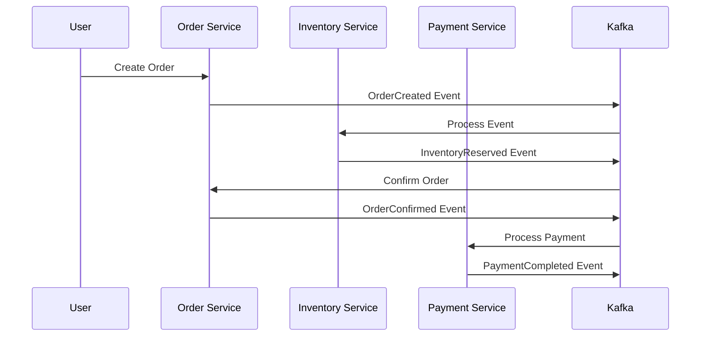

# Kafka 기반 이벤트 소싱 마이크로서비스 연동 실전 예시

## 프로젝트 개요: 간단한 온라인 쇼핑몰

### 시스템 아키텍처
```
[User Service] ──► [Order Service] ──► [Payment Service]
     │                    │                    │
     └──────── Kafka Event Bus ─────────────────┘
     │                    │                    │
[Product Service] ── [Inventory Service] ── [Notification Service]
```

### 서비스 분할
- **User Service** (8081): 사용자 관리
- **Product Service** (8082): 상품 관리  
- **Order Service** (8083): 주문 처리
- **Payment Service** (8084): 결제 처리
- **Inventory Service** (8085): 재고 관리
- **Notification Service** (8086): 알림 발송

## Kafka 토픽 설계

```yaml
# 주요 토픽
user.profile.created     # 사용자 생성
order.lifecycle.created  # 주문 생성
order.lifecycle.confirmed # 주문 확정
payment.transaction.completed # 결제 완료
inventory.stock.reserved # 재고 예약
notification.email.requested # 이메일 알림
```

## 이벤트 소싱 구현

### 기본 이벤트 구조
```java
public abstract class DomainEvent {
    private String eventId;
    private String aggregateId;
    private LocalDateTime timestamp;
    private String eventType;
    private Integer version;
}

@Entity
public class EventStore {
    @Id private String eventId;
    private String aggregateId;
    private String eventType;
    private String eventData;
    private LocalDateTime timestamp;
    private Integer version;
}
```

### 이벤트 발행 서비스
```java
@Service
public class EventSourcingService {
    
    public void saveAndPublishEvent(DomainEvent event, String topicName) {
        // 1. 이벤트 스토어에 저장
        EventStore eventStore = new EventStore();
        eventStore.setEventId(event.getEventId());
        eventStore.setEventData(objectMapper.writeValueAsString(event));
        eventStoreRepository.save(eventStore);
        
        // 2. Kafka로 이벤트 발행
        kafkaTemplate.send(topicName, event.getAggregateId(), event);
    }
}
```

## 서비스별 구현 예시

### 1. Order Service - 주문 생성
```java
@Service
public class OrderService {
    
    public Order createOrder(CreateOrderRequest request) {
        Order order = Order.builder()
            .id(UUID.randomUUID().toString())
            .userId(request.getUserId())
            .items(request.getItems())
            .status(OrderStatus.CREATED)
            .build();
        orderRepository.save(order);
        
        // 주문 생성 이벤트 발행
        OrderCreatedEvent event = OrderCreatedEvent.builder()
            .orderId(order.getId())
            .userId(order.getUserId())
            .items(order.getItems())
            .build();
        eventSourcingService.saveAndPublishEvent(event, "order.lifecycle.created");
        
        return order;
    }
}
```

### 2. Inventory Service - 재고 예약
```java
@Service
public class InventoryService {
    
    @KafkaListener(topics = "order.lifecycle.created")
    public void handleOrderCreated(OrderCreatedEvent event) {
        for (OrderItem item : event.getItems()) {
            reserveStock(event.getOrderId(), item.getProductId(), item.getQuantity());
        }
    }
    
    private void reserveStock(String orderId, String productId, Integer quantity) {
        Inventory inventory = inventoryRepository.findByProductId(productId);
        
        if (inventory.getAvailableQuantity() >= quantity) {
            inventory.reserve(quantity);
            inventoryRepository.save(inventory);
            
            // 재고 예약 성공 이벤트
            InventoryReservedEvent event = InventoryReservedEvent.builder()
                .orderId(orderId)
                .productId(productId)
                .status(ReservationStatus.SUCCESS)
                .build();
            eventSourcingService.saveAndPublishEvent(event, "inventory.stock.reserved");
        }
    }
}
```

### 3. Payment Service - 결제 처리
```java
@Service
public class PaymentService {
    
    @KafkaListener(topics = "order.lifecycle.confirmed")
    public void handleOrderConfirmed(OrderConfirmedEvent event) {
        processPayment(event.getOrderId(), event.getTotalAmount());
    }
    
    private void processPayment(String orderId, BigDecimal amount) {
        Payment payment = Payment.builder()
            .orderId(orderId)
            .amount(amount)
            .status(PaymentStatus.PROCESSING)
            .build();
        paymentRepository.save(payment);
        
        // 외부 결제 게이트웨이 호출
        PaymentResult result = paymentGateway.processPayment(payment);
        
        payment.updateStatus(result.getStatus());
        paymentRepository.save(payment);
        
        // 결제 완료 이벤트
        PaymentCompletedEvent event = PaymentCompletedEvent.builder()
            .orderId(orderId)
            .amount(amount)
            .status(result.getStatus())
            .build();
        eventSourcingService.saveAndPublishEvent(event, "payment.transaction.completed");
    }
}
```

## 주문 처리 플로우



## Docker Compose 구성

```yaml
version: '3.8'
services:
  zookeeper:
    image: confluentinc/cp-zookeeper:7.4.0
    ports: ["2181:2181"]
    
  kafka:
    image: confluentinc/cp-kafka:7.4.0
    ports: ["9092:9092"]
    depends_on: [zookeeper]
    
  postgres:
    image: postgres:15
    ports: ["5432:5432"]
    environment:
      POSTGRES_DB: ecommerce
      POSTGRES_USER: admin
      POSTGRES_PASSWORD: password
      
  order-service:
    build: ./order-service
    ports: ["8083:8083"]
    depends_on: [postgres, kafka]
    
  payment-service:
    build: ./payment-service
    ports: ["8084:8084"]
    depends_on: [postgres, kafka]
```

## 에러 처리 및 보상 트랜잭션

### Saga 패턴 구현
```java
@Component
public class OrderSagaOrchestrator {
    
    @KafkaListener(topics = "payment.transaction.completed")
    public void handlePaymentResult(PaymentCompletedEvent event) {
        if (event.getStatus() == PaymentStatus.FAILED) {
            // 보상 트랜잭션: 재고 해제
            releaseStock(event.getOrderId());
            cancelOrder(event.getOrderId(), "Payment failed");
        }
    }
}
```

## 베스트 프랙티스

### 1. 이벤트 설계
- 이벤트는 불변(Immutable)으로 설계
- 과거형 동사 사용 (UserCreated, OrderConfirmed)
- 충분한 컨텍스트 정보 포함

### 2. 에러 처리
- Dead Letter Queue 구현
- 재시도 정책 설정 (Fixed/Exponential Backoff)
- Circuit Breaker 패턴

### 3. 모니터링
- 이벤트 처리 메트릭 수집
- 분산 트레이싱 (Sleuth + Zipkin)
- 헬스 체크 및 알림

이 예시는 실제 운영 가능한 수준의 Kafka 기반 이벤트 소싱 마이크로서비스 아키텍처를 보여줍니다. 