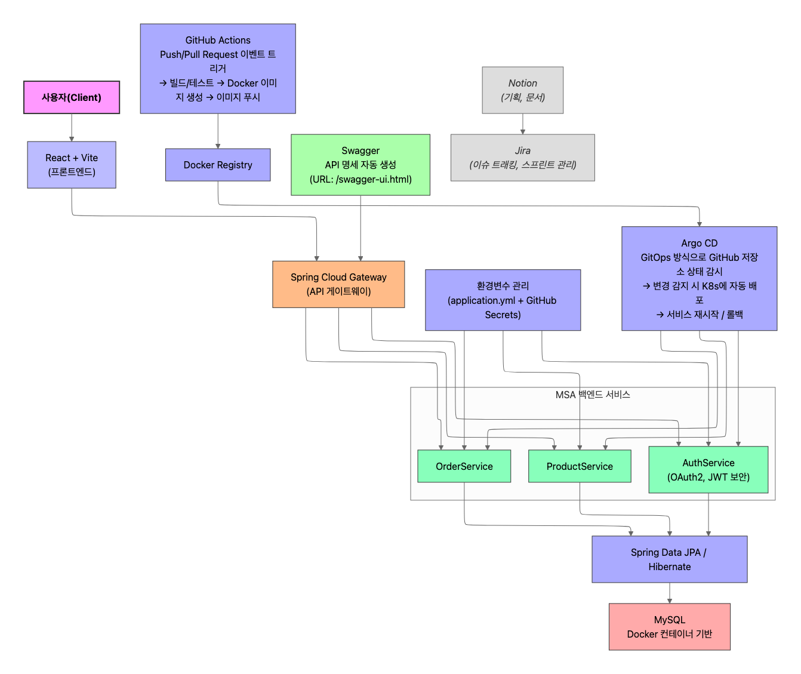
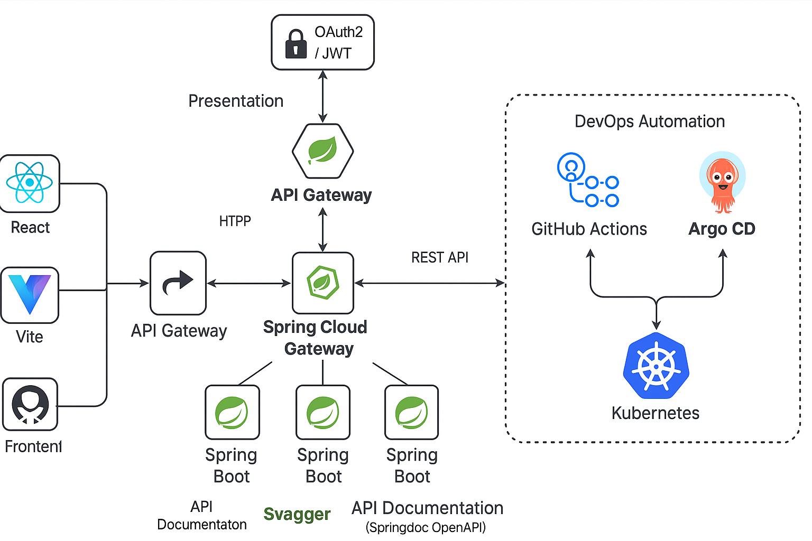

# 🌐 MSA 기반 아키텍처 기술서 (Spring Boot + React + GitHub Actions + Argo CD)

## 1. 개요

이 문서는 Spring Boot와 React를 활용하여 MSA(Microservice Architecture) 기반 애플리케이션을 구축하고, CI/CD 파이프라인을 통해 자동화된 배포를 진행하는 개발 환경을 설명합니다.

---

## 2. 아키텍처 구성 개요

```
[사용자] → [React + Vite 프론트엔드] → [Spring Cloud Gateway] → [각 MSA 서비스 (Spring Boot)]
                                                      ↓
                                        [Swagger (API 문서)]
                                                      ↓
                                      [OAuth2 / JWT 인증]

CI: GitHub Actions (코드 변경 시 자동 테스트 및 빌드)
CD: Argo CD (Git 기반의 자동 배포)

코드 관리: GitHub
프로젝트 관리: Notion, Jira
배포 환경: Docker, Kubernetes
```

---

## 3. 주요 도구 및 개념

### 📦 백엔드

* **Spring Boot**: REST API 서버 개발
* **Spring Security + OAuth2 + JWT**: 인증/인가
* **Spring Cloud Gateway**: API 게이트웨이로 요청 라우팅 및 필터링
* **Springdoc OpenAPI(Swagger)**: API 자동 문서화

### 💻 프론트엔드

* **React + Vite**: 프론트엔드 구현

### ⚙️ CI/CD

* **GitHub Actions**: 코드 푸시 시 자동으로 테스트/빌드 수행
* **Argo CD**: Git에 있는 Kubernetes 매니페스트를 기준으로 자동 배포

### ☁️ 배포/인프라

* **Docker**: 실행 환경 통일
* **Kubernetes**: 컨테이너 오케스트레이션
* **kubectl**: Kubernetes 클러스터 제어 CLI

---

## 4. 개발 흐름

1. 개발자는 백엔드(Spring Boot) 또는 프론트엔드(React) 코드를 작성함
2. 로컬에서 Docker 환경으로 테스트함 (`Dockerfile`로 빌드 후 실행)
3. 정상 작동 시 GitHub에 코드 푸시
4. GitHub Actions가 자동으로 빌드/테스트를 실행
5. 성공 시 Docker 이미지 생성 및 DockerHub 등 이미지 저장소로 푸시
6. Kubernetes 매니페스트가 있는 Git 레포지토리에 업데이트
7. Argo CD가 이를 감지하여 자동 배포 수행
8. 실제 클러스터에서 사용자 요청을 처리함

---

## 5. 핵심 설정 예시

### ✅ GitHub Actions 설정 (`.github/workflows/backend.yml`)

```yaml
name: CI for Spring Boot

on:
  push:
    branches: [ main ]

jobs:
  build:
    runs-on: ubuntu-latest
    steps:
    - uses: actions/checkout@v3
    - name: Set up JDK
      uses: actions/setup-java@v3
      with:
        java-version: '17'
    - name: Build with Gradle
      run: ./gradlew build
```

### ✅ Argo CD 배포 예시 (Kubernetes 매니페스트)

```yaml
apiVersion: apps/v1
kind: Deployment
metadata:
  name: backend-service
spec:
  replicas: 1
  selector:
    matchLabels:
      app: backend
  template:
    metadata:
      labels:
        app: backend
    spec:
      containers:
      - name: backend
        image: your-dockerhub-id/backend:latest
        ports:
        - containerPort: 8080
```

### ✅ Dockerfile 예시 (Spring Boot)

```dockerfile
FROM openjdk:17-alpine
ARG JAR_FILE=build/libs/*.jar
COPY ${JAR_FILE} app.jar
ENTRYPOINT ["java","-jar","/app.jar"]
```

---

## 6. 권장 도구 (선택 사항)

| 도구         | 목적     | 설명                    |
| ---------- | ------ | --------------------- |
| Prometheus | 모니터링   | 앱 상태를 시각화할 수 있음       |
| Grafana    | 시각화    | 모니터링 지표 보기            |
| Sentry     | 에러 추적  | 실시간 에러 확인             |
| Helm       | 패키지 관리 | Kubernetes 앱 배포를 더 쉽게 |

---

## 7. 보안 주의사항

* `.env` 또는 `application.yml` 등 환경변수는 Docker 환경에도 전달되도록 처리
* 필수 환경변수가 없으면 컨테이너가 정상 작동하지 않을 수 있음
* `Kubernetes Secret`을 사용해 민감 정보를 관리할 것

---

## 8. 결론

* 이 구조는 작은 팀부터 대규모 시스템까지 확장 가능한 구조입니다.
* 누구나 쉽게 유지보수하고 배포할 수 있게 만들어줍니다.
* CI/CD와 컨테이너 환경이 결합되어 반복 작업 없이 빠르고 안정적인 배포가 가능합니다.

---





* 이미지에 존재하는 hptt -> http