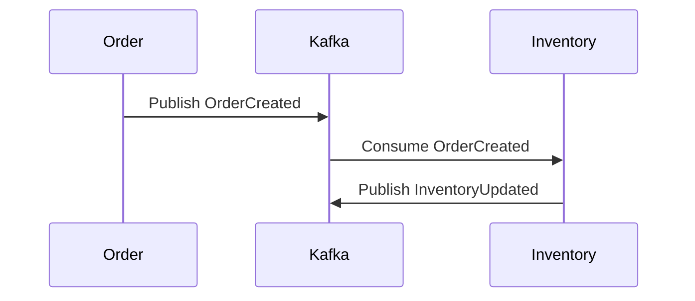

# MSA 이벤트 기반 아키텍처 배포 실습 가이드

이 가이드는 MSA(Microservice Architecture) 이벤트 기반 아키텍처를 다양한 환경에서 배포하고 검증하는 실습을 다룹니다. 초보자는 Stage 1부터 시작해 점진적으로 고급 환경(Stage 5)으로 넘어갈 수 있습니다. 각 단계는 “무엇을? 왜? 어떻게?” 구조로 구성되며, 오류 처리, 최적화 팁, 실무 적용 사례를 포함합니다.

## 목차
- [대상 독자](#대상-독자)
- [용어 사전](#용어-사전)
- [Stage 1: 로컬 개발·테스트 환경 (Docker Compose)](#stage-1-로컬-개발테스트-환경-docker-compose)
- [Stage 2: 스테이징·QA 환경 (TLS & 모니터링 추가)](#stage-2-스테이징qa-환경-tls--모니터링-추가)
- [Stage 3: 컨테이너 오케스트레이션 프로덕션 (Kubernetes + Strimzi)](#stage-3-컨테이너-오케스트레이션-프로덕션-kubernetes--strimzi)
- [Stage 4: 패키지 설치 기반 프로덕션 (Bare-Metal / VM)](#stage-4-패키지-설치-기반-프로덕션-bare-metal--vm)
- [Stage 5: 매니지드 서비스 (AWS MSK / Confluent Cloud)](#stage-5-매니지드-서비스-aws-msk--confluent-cloud)
- [FAQ 및 커뮤니티 지원](#faq-및-커뮤니티-지원)

## 용어 사전
- **Kafka Consumer Group**: 동일한 토픽의 메시지를 여러 컨슈머가 분산 처리하도록 그룹화한 개념.
- **Strimzi Operator**: Kubernetes에서 Kafka 클러스터를 관리하기 위한 오퍼레이터.
- **DeadLetterQueue(DLQ)**: 처리 실패한 메시지를 저장해 재처리하거나 분석할 수 있는 별도 큐.
- **Prometheus**: 오픈소스 모니터링 도구로, 메트릭을 수집해 시각화.
- **Grafana**: Prometheus 데이터를 시각화하는 대시보드 도구.

## Stage 1: 로컬 개발·테스트 환경 (Docker Compose)

### 무엇을?
Kafka, Zookeeper, Spring Boot 기반 마이크로서비스(`order`, `inventory`, `payment`, `orchestrator`)를 Docker Compose로 실행해 이벤트 흐름을 검증합니다.

### 왜?
- 빠른 프로토타입 작성과 디버깅
- 서비스 간 비동기 통신 기초 확인
- 팀원 간 동일한 개발 환경 보장

### 어떻게?
#### 1.1 디렉토리 구조 준비
```bash
mkdir -p msa-docker/{kafka,order-service,inventory-service,payment-service,orchestrator}
cd msa-docker
```

#### 1.2 `docker-compose.yml` 작성
```yaml
version: '3.8'
services:
  zookeeper:
    image: confluentinc/cp-zookeeper:7.5.0
    environment:
      ZOOKEEPER_CLIENT_PORT: 2181

  kafka:
    image: confluentinc/cp-kafka:7.5.0
    depends_on: [zookeeper]
    environment:
      KAFKA_BROKER_ID: 1
      KAFKA_ZOOKEEPER_CONNECT: 'zookeeper:2181'
      KAFKA_LISTENERS: PLAINTEXT://0.0.0.0:9092
      KAFKA_ADVERTISED_LISTENERS: PLAINTEXT://localhost:9092
      KAFKA_OFFSETS_TOPIC_REPLICATION_FACTOR: 1
    ports:
      - '9092:9092'

  order-service:
    build: ./order-service
    environment:
      SPRING_PROFILES_ACTIVE: docker
      KAFKA_BOOTSTRAP_SERVERS: kafka:9092
    depends_on: [kafka]
    ports:
      - '8080:8080'

  inventory-service:
    build: ./inventory-service
    environment:
      SPRING_PROFILES_ACTIVE: docker
      KAFKA_BOOTSTRAP_SERVERS: kafka:9092
    depends_on: [kafka]
    ports:
      - '8081:8081'

  payment-service:
    build: ./payment-service
    environment:
      SPRING_PROFILES_ACTIVE: docker
      KAFKA_BOOTSTRAP_SERVERS: kafka:9092
    depends_on: [kafka]
    ports:
      - '8082:8082'

  orchestrator:
    build: ./orchestrator
    environment:
      SPRING_PROFILES_ACTIVE: docker
      KAFKA_BOOTSTRAP_SERVERS: kafka:9092
    depends_on: [order-service, inventory-service, payment-service]
    ports:
      - '8083:8083'
```

#### 1.3 서비스 템플릿 생성
각 서비스 디렉토리로 이동해 Spring Boot 프로젝트 초기화:
```bash
cd order-service
spring init --build=maven --dependencies=web,kafka order-service
# inventory-service, payment-service, orchestrator도 동일하게
```
**프로젝트 구조**:
- `pom.xml`: Maven 의존성 관리 (Spring Web, Kafka 포함)
- `src/main/java`: 애플리케이션 코드
- `src/main/resources/application.yml`: 설정 파일

#### 1.4 이벤트 및 Kafka 설정
`src/main/resources/application-docker.yml`:
```yaml
spring:
  kafka:
    bootstrap-servers: ${KAFKA_BOOTSTRAP_SERVERS} # Kafka 브로커 주소
    producer:
      key-serializer: org.apache.kafka.common.serialization.StringSerializer
      value-serializer: org.springframework.kafka.support.serializer.JsonSerializer
    consumer:
      group-id: ${spring.application.name} # 컨슈머 그룹 ID
      key-deserializer: org.apache.kafka.common.serialization.StringDeserializer
      value-deserializer: org.springframework.kafka.support.serializer.JsonDeserializer
      properties:
        spring.json.trusted.packages: "*" # JSON 역직렬화 시 안전한 패키지 지정
```

**도메인 이벤트 정의** (`OrderCreated.java`):
```java
public class OrderCreated {
    private String orderId;
    private String userId;
    private List<OrderItem> items;

    // Constructor
    public OrderCreated(String orderId, String userId, List<OrderItem> items) {
        this.orderId = orderId;
        this.userId = userId;
        this.items = items;
    }

    // Getters/Setters
    public String getOrderId() { return orderId; }
    public void setOrderId(String orderId) { this.orderId = orderId; }
    public String getUserId() { return userId; }
    public void setUserId(String userId) { this.userId = userId; }
    public List<OrderItem> getItems() { return items; }
    public void setItems(List<OrderItem> items) { this.items = items; }
}
```

**서비스 간 상호작용 예시** (`OrderEventListener.java` in `inventory-service`):
```java
@Component
public class OrderEventListener {
    @KafkaListener(topics = "order.created", groupId = "inventory-service")
    public void handleOrderCreated(OrderCreated event) {
        System.out.println("Received order: " + event.getOrderId());
        // 재고 업데이트 로직
    }
}
```

**이벤트 흐름 다이어그램**:


#### 1.5 클러스터 기동 및 검증
```bash
docker-compose up -d
docker-compose ps
```

**주문 요청 테스트**:
```bash
curl -X POST http://localhost:8080/orders -H "Content-Type: application/json" \
  -d '{"userId":"u123","items":[{"productId":"p1","qty":2}]}'
```

**로그 확인**:
```bash
docker-compose logs -f order-service inventory-service payment-service orchestrator
```

**부하 테스트 (k6)**:
```bash
k6 run -e ENDPOINT=http://localhost:8080/orders script.js
```
`script.js` 예시:
```javascript
import http from 'k6/http';
export default function () {
    http.post(`${__ENV.ENDPOINT}`, JSON.stringify({
        userId: 'u123',
        items: [{ productId: 'p1', qty: 2 }]
    }), { headers: { 'Content-Type': 'application/json' } });
}
```

#### 오류 디버깅 팁
- **Kafka 연결 실패**: `KAFKA_BOOTSTRAP_SERVERS`와 `KAFKA_ADVERTISED_LISTENERS` 확인.
- **이벤트 컨슘 실패**: 컨슈머 그룹 ID 충돌 또는 토픽 생성 여부 점검 (`kafka-topics.sh --list`).
- **부하 테스트 실패**: 응답 시간과 성공률 확인 (`k6` 출력 로그 분석).

## Stage 2: 스테이징·QA 환경 (TLS & 모니터링 추가)

### 무엇을?
Kafka에 TLS/SASL 인증을 적용하고, Prometheus와 Grafana로 메트릭을 수집·시각화합니다.

### 왜?
- 데이터 암호화 및 인증으로 보안 강화
- 서비스 상태와 메시지 흐름 모니터링

### 어떻게?
#### 2.1 TLS 인증서 및 사용자 설정
```bash
# 인증서 생성
openssl req -new -x509 -keyout ca.key -out ca.crt -days 365 -subj "/CN=ca"
# server.keystore.jks, server.truststore.jks 생성 (생략)
```

`docker-compose.yml`에 Kafka SSL 설정 추가:
```yaml
services:
  kafka:
    environment:
      KAFKA_LISTENERS: SSL://0.0.0.0:9093
      KAFKA_SSL_KEYSTORE_LOCATION: /certs/server.keystore.jks
      KAFKA_SSL_KEYSTORE_PASSWORD: changeit
      KAFKA_SSL_TRUSTSTORE_LOCATION: /certs/server.truststore.jks
      KAFKA_SSL_TRUSTSTORE_PASSWORD: changeit
    volumes:
      - ./certs:/certs
    ports:
      - '9093:9093'
```

#### 2.2 Spring Boot 서비스에 SSL/SASL 설정
`application-staging.yml`:
```yaml
spring:
  kafka:
    bootstrap-servers: kafka:9093 # SSL용 포트
    security:
      protocol: SSL
    ssl:
      trust-store-location: classpath:certs/client.truststore.jks
      trust-store-password: changeit
      key-store-location: classpath:certs/client.keystore.jks
      key-store-password: changeit
```

#### 2.3 Prometheus + Grafana 연동
`prometheus.yml`:
```yaml
scrape_configs:
  - job_name: 'services'
    static_configs:
      - targets: ['order-service:8080', 'inventory-service:8081', 'payment-service:8082', 'orchestrator:8083']
  - job_name: 'kafka'
    static_configs:
      - targets: ['kafka:9999'] # JMX Exporter 포트
```

**Grafana 대시보드**:
- 주요 메트릭: `kafka_consumer_lag` (컨슈머 지연), `kafka_messages_per_second` (메시지 처리율)
- 추천 패널: 컨슈머 랙 그래프, 브로커별 메시지 처리율.

#### 오류 디버깅 팁
- **SSL handshake 실패**: 인증서 체인 및 비밀번호 확인.
- **Prometheus scrape 실패**: `/actuator/prometheus` 엔드포인트 활성화 여부 확인.

## Stage 3: 컨테이너 오케스트레이션 프로덕션 (Kubernetes + Strimzi)

### 무엇을?
Strimzi Kafka Operator와 Kubernetes Deployment로 클러스터 및 서비스를 선언적으로 배포합니다.

### 왜?
- 자동 스케일링, 롤링 업데이트, 자가 치유
- 대규모 운영 환경 지원

### 어떻게?
#### 3.1 네임스페이스 및 Strimzi 설치
```bash
kubectl create namespace msa
kubectl apply -f 'https://strimzi.io/install/latest?namespace=msa' -n msa
```

#### 3.2 Kafka 클러스터 CR 생성 (`kafka-cluster.yaml`)
```yaml
apiVersion: kafka.strimzi.io/v1beta2
kind: Kafka
metadata:
  name: kafka-cluster
  namespace: msa
spec:
  kafka:
    version: 3.5.1
    replicas: 3
    listeners:
      - name: plain
        port: 9092
        type: internal
        tls: false
    resources:
      requests:
        cpu: "1"
        memory: "2Gi"
      limits:
        cpu: "2"
        memory: "4Gi"
  zookeeper:
    replicas: 3
    resources:
      requests:
        cpu: "0.5"
        memory: "1Gi"
      limits:
        cpu: "1"
        memory: "2Gi"
  entityOperator: {}
```

#### 3.3 Kafka 토픽 생성 (`order-topic.yaml`)
```yaml
apiVersion: kafka.strimzi.io/v1beta2
kind: KafkaTopic
metadata:
  name: order.created
  namespace: msa
  labels:
    strimzi.io/cluster: kafka-cluster
spec:
  partitions: 3
  replicas: 3
```

#### 3.4 서비스 Deployment/Service (`order-deployment.yaml`)
```yaml
apiVersion: apps/v1
kind: Deployment
metadata:
  name: order-service
  namespace: msa
spec:
  replicas: 2
  selector:
    matchLabels:
      app: order-service
  template:
    metadata:
      labels:
        app: order-service
    spec:
      containers:
      - name: order
        image: myrepo/order-service:latest
        ports:
        - containerPort: 8080
        env:
        - name: KAFKA_BOOTSTRAP_SERVERS
          value: 'kafka-cluster-kafka-bootstrap:9092'
```

#### 3.5 배포 및 검증
```bash
kubectl apply -f kafka-cluster.yaml -n msa
kubectl apply -f order-topic.yaml -n msa
kubectl apply -f order-deployment.yaml -n msa
kubectl get pods -n msa
kubectl logs -l app=order-service -n msa
```

#### 오류 디버깅 팁
- **Pod CrashLoopBackOff**: 이미지 태그와 환경 변수 확인.
- **Kafka CR 상태**: `kubectl describe kafka kafka-cluster -n msa`.

## Stage 4: 패키지 설치 기반 프로덕션 (Bare-Metal / VM)

### 무엇을?
OS 패키지 매니저로 Kafka와 Zookeeper를 설치하고, `systemd`로 Spring Boot 서비스를 운영합니다.

### 왜?
- 컨테이너 사용 제약 환경 대응
- OS 수준 세밀한 튜닝

### 어떻게?
#### 4.1 Kafka 설치
```bash
# Debian/Ubuntu
wget https://downloads.apache.org/kafka/3.5.1/kafka_2.13-3.5.1.tgz
tar -xzf kafka_2.13-3.5.1.tgz -C /opt
ln -s /opt/kafka_2.13-3.5.1 /opt/kafka
```

#### 4.2 `systemd` 유닛 파일 생성 (`/etc/systemd/system/kafka.service`)
```ini
[Unit]
Description=Apache Kafka
After=zookeeper.service

[Service]
Type=simple
User=kafka
ExecStart=/opt/kafka/bin/kafka-server-start.sh /opt/kafka/config/server.properties
ExecStop=/opt/kafka/bin/kafka-server-stop.sh
Restart=on-failure

[Install]
WantedBy=multi-user.target
```

Spring Boot 앱도 유사하게 `/etc/systemd/system/order.service` 생성 후:
```bash
systemctl enable --now order.service
```

#### 오류 디버깅 팁
- **포트 충돌**: `ss -tuln | grep 9092`
- **권한 문제**: `kafka` 사용자 권한 및 `WorkingDirectory` 확인.

## Stage 5: 매니지드 서비스 (AWS MSK / Confluent Cloud)

### 무엇을?
AWS MSK 또는 Confluent Cloud로 Kafka를 운영하고, Fargate/EKS로 마이크로서비스를 배포합니다.

### 왜?
- 운영 부담 경감 (업데이트·백업 자동화)
- SLA 기반 안정성 확보

### 어떻게?
#### 5.1 AWS MSK 클러스터 생성
```bash
aws msk create-cluster \
  --cluster-name msa-cluster \
  --kafka-version 3.5.1 \
  --number-of-broker-nodes 2 \
  --broker-node-group-info file://broker-config.json
```
**비용 최적화**: 소규모 테스트는 브로커 노드 2개, 최소 스토리지로 설정.

#### 5.2 Confluent Cloud 설정
- Confluent 콘솔에서 Kafka 클러스터 생성.
- API Key/Secret 발급 후 `application-prod.yml`에 입력:
```yaml
spring:
  kafka:
    bootstrap-servers: <confluent-bootstrap-servers>
    properties:
      sasl.mechanism: PLAIN
      security.protocol: SASL_SSL
      sasl.jaas.config: org.apache.kafka.common.security.plain.PlainLoginModule required \
        username="<api-key>" \
        password="<api-secret>";
```

**보안 팁**: API Key는 AWS Secrets Manager에 저장해 관리.

#### 5.3 서비스 배포
- **EKS**: Helm 차트 또는 `kubectl apply`로 배포.
- **Fargate**: ECS Task Definition + Service 설정.
- **Auto Scaling**: CPU 사용량 기반 스케일링 정책 추가.

#### 오류 디버깅 팁
- **연결 오류**: VPC 보안 그룹, MSK 클라이언트 서브넷 확인.
- **인증 실패**: API Key/Secret 및 ACL 설정 점검.

