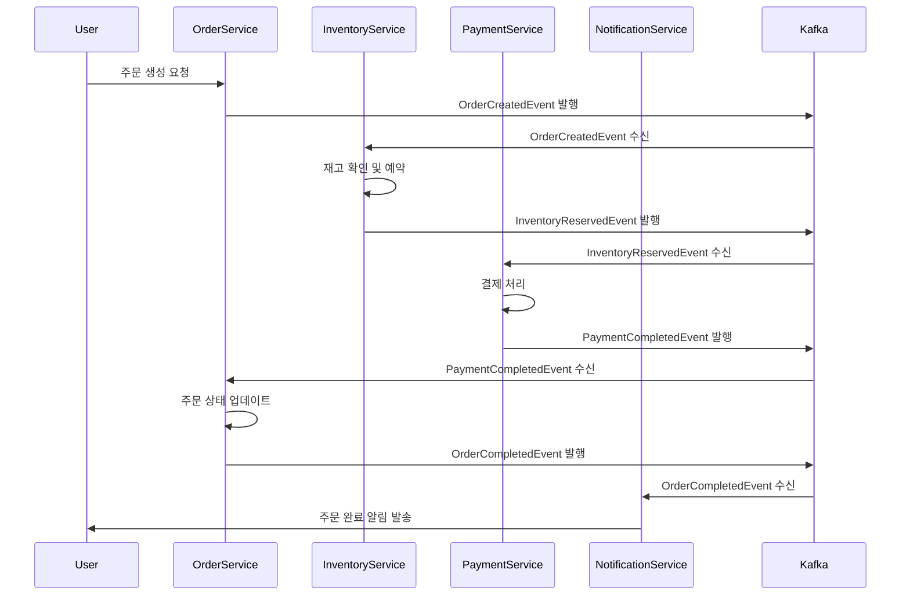

# 전자상거래 이벤트 기반 시스템 구현 가이드

## 1. 시스템 아키텍처 설계

### 서비스 분해 및 바운디드 컨텍스트
```yaml
# 마이크로서비스 구조
services:
  user-service:
    domain: 사용자 관리
    responsibilities:
      - 회원가입/로그인
      - 프로필 관리
      - 인증/인가
    events:
      - UserRegisteredEvent
      - UserProfileUpdatedEvent
      - UserDeactivatedEvent
  
  catalog-service:
    domain: 상품 카탈로그
    responsibilities:
      - 상품 정보 관리
      - 카테고리 관리
      - 검색 및 필터링
    events:
      - ProductCreatedEvent
      - ProductUpdatedEvent
      - ProductDeletedEvent
      - InventoryUpdatedEvent
  
  order-service:
    domain: 주문 관리
    responsibilities:
      - 주문 생성/수정/취소
      - 주문 상태 관리
      - 주문 히스토리
    events:
      - OrderCreatedEvent
      - OrderUpdatedEvent
      - OrderCancelledEvent
      - OrderCompletedEvent
  
  payment-service:
    domain: 결제 처리
    responsibilities:
      - 결제 처리
      - 환불 처리
      - 결제 수단 관리
    events:
      - PaymentInitiatedEvent
      - PaymentCompletedEvent
      - PaymentFailedEvent
      - RefundProcessedEvent
  
  inventory-service:
    domain: 재고 관리
    responsibilities:
      - 재고 추적
      - 재고 예약/해제
      - 재고 알림
    events:
      - InventoryReservedEvent
      - InventoryReleasedEvent
      - LowStockEvent
      - OutOfStockEvent
  
  notification-service:
    domain: 알림 관리
    responsibilities:
      - 이메일 알림
      - SMS 알림
      - 푸시 알림
    events:
      - NotificationSentEvent
      - NotificationFailedEvent
```

### 이벤트 플로우 설계


## 2. 도메인 이벤트 정의

### 주문 도메인 이벤트
```java
// 주문 생성 이벤트
public class OrderCreatedEvent extends DomainEvent {
    
    private String orderId;
    private String customerId;
    private List<OrderItem> items;
    private BigDecimal totalAmount;
    private String shippingAddress;
    private PaymentMethod paymentMethod;
    private Instant orderDate;
    
    public OrderCreatedEvent(String orderId, String customerId, 
                           List<OrderItem> items, BigDecimal totalAmount,
                           String shippingAddress, PaymentMethod paymentMethod) {
        super();
        this.orderId = orderId;
        this.customerId = customerId;
        this.items = items;
        this.totalAmount = totalAmount;
        this.shippingAddress = shippingAddress;
        this.paymentMethod = paymentMethod;
        this.orderDate = Instant.now();
    }
    
    // getters
}

// 주문 상태 변경 이벤트
public class OrderStatusChangedEvent extends DomainEvent {
    
    private String orderId;
    private OrderStatus previousStatus;
    private OrderStatus newStatus;
    private String reason;
    private Instant changedAt;
    
    // 생성자, getter
}

// 주문 항목 업데이트 이벤트
public class OrderItemsUpdatedEvent extends DomainEvent {
    
    private String orderId;
    private List<OrderItem> previousItems;
    private List<OrderItem> newItems;
    private BigDecimal previousTotal;
    private BigDecimal newTotal;
    
    // 생성자, getter
}
```

### 재고 도메인 이벤트
```java
// 재고 예약 이벤트
public class InventoryReservedEvent extends DomainEvent {
    
    private String reservationId;
    private String orderId;
    private String productId;
    private int reservedQuantity;
    private int availableQuantity;
    private Instant reservedAt;
    private Duration reservationDuration;
    
    // 생성자, getter
}

// 재고 부족 이벤트
public class InventoryShortageEvent extends DomainEvent {
    
    private String productId;
    private int requestedQuantity;
    private int availableQuantity;
    private String orderId;
    private Instant detectedAt;
    
    // 생성자, getter
}

// 재고 보충 이벤트
public class InventoryReplenishedEvent extends DomainEvent {
    
    private String productId;
    private int replenishedQuantity;
    private int newTotalQuantity;
    private String supplierId;
    private Instant replenishedAt;
    
    // 생성자, getter
}
```

### 결제 도메인 이벤트
```java
// 결제 시작 이벤트
public class PaymentInitiatedEvent extends DomainEvent {
    
    private String paymentId;
    private String orderId;
    private String customerId;
    private BigDecimal amount;
    private String currency;
    private PaymentMethod paymentMethod;
    private Instant initiatedAt;
    
    // 생성자, getter
}

// 결제 완료 이벤트
public class PaymentCompletedEvent extends DomainEvent {
    
    private String paymentId;
    private String orderId;
    private String transactionId;
    private BigDecimal amount;
    private String currency;
    private PaymentMethod paymentMethod;
    private Instant completedAt;
    private String gatewayResponse;
    
    // 생성자, getter
}

// 환불 처리 이벤트
public class RefundProcessedEvent extends DomainEvent {
    
    private String refundId;
    private String originalPaymentId;
    private String orderId;
    private BigDecimal refundAmount;
    private RefundReason reason;
    private Instant processedAt;
    
    // 생성자, getter
}
```

## 3. Saga 패턴을 통한 주문 처리 플로우

### 주문 처리 Saga
```java
@Component
public class OrderProcessingSaga {
    
    private final InventoryService inventoryService;
    private final PaymentService paymentService;
    private final OrderService orderService;
    private final NotificationService notificationService;
    private final SagaManager sagaManager;
    
    @EventListener
    @Async
    public void handleOrderCreated(OrderCreatedEvent event) {
        String sagaId = UUID.randomUUID().toString();
        OrderProcessingSagaData sagaData = new OrderProcessingSagaData(event);
        
        SagaTransaction saga = sagaManager.createSaga(
            sagaId, 
            "OrderProcessingSaga", 
            event.getOrderId(),
            sagaData
        );
        
        try {
            // 1단계: 재고 확인 및 예약
            executeInventoryReservation(saga, event);
            
        } catch (Exception e) {
            handleSagaFailure(saga, "INVENTORY_RESERVATION", e);
        }
    }
    
    private void executeInventoryReservation(SagaTransaction saga, OrderCreatedEvent event) {
        sagaManager.startStep(saga.getSagaId(), "INVENTORY_RESERVATION");
        
        try {
            List<InventoryReservationRequest> requests = event.getItems().stream()
                .map(item -> new InventoryReservationRequest(
                    item.getProductId(),
                    item.getQuantity(),
                    event.getOrderId()
                ))
                .toList();
            
            InventoryReservationResult result = inventoryService.reserveItems(requests);
            
            if (result.isSuccess()) {
                sagaManager.completeStep(saga.getSagaId(), "INVENTORY_RESERVATION");
                // 다음 단계로 진행
                proceedToPayment(saga, event, result);
            } else {
                throw new InventoryReservationException(result.getFailureReason());
            }
            
        } catch (Exception e) {
            sagaManager.failStep(saga.getSagaId(), "INVENTORY_RESERVATION", e.getMessage());
            throw e;
        }
    }
    
    private void proceedToPayment(SagaTransaction saga, OrderCreatedEvent event, 
                                InventoryReservationResult inventoryResult) {
        sagaManager.startStep(saga.getSagaId(), "PAYMENT_PROCESSING");
        
        try {
            PaymentRequest paymentRequest = new PaymentRequest(
                event.getOrderId(),
                event.getCustomerId(),
                event.getTotalAmount(),
                event.getPaymentMethod()
            );
            
            PaymentResult result = paymentService.processPayment(paymentRequest);
            
            if (result.isSuccess()) {
                sagaManager.completeStep(saga.getSagaId(), "PAYMENT_PROCESSING");
                // 주문 완료 처리
                completeOrder(saga, event, result);
            } else {
                throw new PaymentProcessingException(result.getFailureReason());
            }
            
        } catch (Exception e) {
            sagaManager.failStep(saga.getSagaId(), "PAYMENT_PROCESSING", e.getMessage());
            // 재고 예약 해제
            compensateInventoryReservation(saga, inventoryResult);
            throw e;
        }
    }
    
    private void completeOrder(SagaTransaction saga, OrderCreatedEvent event, 
                             PaymentResult paymentResult) {
        try {
            orderService.completeOrder(event.getOrderId(), paymentResult.getPaymentId());
            sagaManager.completeSaga(saga.getSagaId());
            
            // 완료 알림 발송
            sendOrderCompletionNotification(event, paymentResult);
            
        } catch (Exception e) {
            // 결제 환불 및 재고 해제
            compensatePayment(saga, paymentResult);
            compensateInventoryReservation(saga, null);
            handleSagaFailure(saga, "ORDER_COMPLETION", e);
        }
    }
    
    private void compensateInventoryReservation(SagaTransaction saga, 
                                              InventoryReservationResult result) {
        try {
            if (result != null && result.getReservationId() != null) {
                inventoryService.releaseReservation(result.getReservationId());
            }
        } catch (Exception e) {
            log.error("Failed to compensate inventory reservation for saga: {}", 
                     saga.getSagaId(), e);
        }
    }
    
    private void compensatePayment(SagaTransaction saga, PaymentResult result) {
        try {
            if (result != null && result.getPaymentId() != null) {
                paymentService.refund(result.getPaymentId(), result.getAmount());
            }
        } catch (Exception e) {
            log.error("Failed to compensate payment for saga: {}", saga.getSagaId(), e);
        }
    }
    
    private void handleSagaFailure(SagaTransaction saga, String failedStep, Exception e) {
        sagaManager.failSaga(saga.getSagaId(), e.getMessage());
        
        // 주문 취소 처리
        OrderProcessingSagaData sagaData = sagaManager.getSagaData(
            saga.getSagaId(), 
            OrderProcessingSagaData.class
        );
        
        orderService.cancelOrder(sagaData.getOrderId(), "Saga execution failed: " + e.getMessage());
        
        // 실패 알림 발송
        sendOrderFailureNotification(sagaData, e.getMessage());
    }
    
    private void sendOrderCompletionNotification(OrderCreatedEvent event, PaymentResult result) {
        NotificationRequest notification = NotificationRequest.builder()
            .customerId(event.getCustomerId())
            .type(NotificationType.ORDER_COMPLETED)
            .channel(NotificationChannel.EMAIL)
            .templateData(Map.of(
                "orderId", event.getOrderId(),
                "totalAmount", event.getTotalAmount(),
                "paymentMethod", event.getPaymentMethod().name()
            ))
            .build();
        
        notificationService.sendNotification(notification);
    }
    
    private void sendOrderFailureNotification(OrderProcessingSagaData sagaData, String reason) {
        NotificationRequest notification = NotificationRequest.builder()
            .customerId(sagaData.getCustomerId())
            .type(NotificationType.ORDER_FAILED)
            .channel(NotificationChannel.EMAIL)
            .templateData(Map.of(
                "orderId", sagaData.getOrderId(),
                "failureReason", reason
            ))
            .build();
        
        notificationService.sendNotification(notification);
    }
}
```

## 4. 이벤트 기반 재고 관리

### 실시간 재고 추적
```java
@Service
public class InventoryTrackingService {
    
    private final InventoryRepository inventoryRepository;
    private final RedisTemplate<String, Object> redisTemplate;
    private final ApplicationEventPublisher eventPublisher;
    
    @EventListener
    @Transactional
    public void handleInventoryReserved(InventoryReservedEvent event) {
        // 데이터베이스 재고 업데이트
        Inventory inventory = inventoryRepository.findByProductId(event.getProductId())
            .orElseThrow(() -> new InventoryNotFoundException(event.getProductId()));
        
        inventory.reserve(event.getReservedQuantity());
        inventoryRepository.save(inventory);
        
        // Redis 캐시 업데이트
        updateInventoryCache(event.getProductId(), inventory.getAvailableQuantity());
        
        // 재고 부족 체크
        checkLowStock(inventory);
    }
    
    @EventListener
    @Transactional
    public void handleInventoryReleased(InventoryReleasedEvent event) {
        Inventory inventory = inventoryRepository.findByProductId(event.getProductId())
            .orElseThrow(() -> new InventoryNotFoundException(event.getProductId()));
        
        inventory.release(event.getReleasedQuantity());
        inventoryRepository.save(inventory);
        
        // Redis 캐시 업데이트
        updateInventoryCache(event.getProductId(), inventory.getAvailableQuantity());
        
        // 재고 보충 알림
        if (inventory.getAvailableQuantity() > inventory.getLowStockThreshold()) {
            eventPublisher.publishEvent(new StockRestoredEvent(
                event.getProductId(),
                inventory.getAvailableQuantity()
            ));
        }
    }
    
    @EventListener
    @Transactional
    public void handleInventoryReplenished(InventoryReplenishedEvent event) {
        Inventory inventory = inventoryRepository.findByProductId(event.getProductId())
            .orElseThrow(() -> new InventoryNotFoundException(event.getProductId()));
        
        inventory.replenish(event.getReplenishedQuantity());
        inventoryRepository.save(inventory);
        
        // Redis 캐시 업데이트
        updateInventoryCache(event.getProductId(), inventory.getTotalQuantity());
        
        // 재고 보충 완료 알림
        eventPublisher.publishEvent(new InventoryReplenishmentCompletedEvent(
            event.getProductId(),
            event.getReplenishedQuantity(),
            inventory.getTotalQuantity()
        ));
    }
    
    private void updateInventoryCache(String productId, int availableQuantity) {
        String cacheKey = "inventory:" + productId;
        InventoryCache cacheData = new InventoryCache(productId, availableQuantity, Instant.now());
        
        redisTemplate.opsForValue().set(cacheKey, cacheData, Duration.ofMinutes(30));
        
        // 웹소켓을 통한 실시간 재고 업데이트
        messagingTemplate.convertAndSend(
            "/topic/inventory/" + productId,
            Map.of("productId", productId, "availableQuantity", availableQuantity)
        );
    }
    
    private void checkLowStock(Inventory inventory) {
        if (inventory.getAvailableQuantity() <= inventory.getLowStockThreshold()) {
            eventPublisher.publishEvent(new LowStockEvent(
                inventory.getProductId(),
                inventory.getAvailableQuantity(),
                inventory.getLowStockThreshold()
            ));
        }
        
        if (inventory.getAvailableQuantity() == 0) {
            eventPublisher.publishEvent(new OutOfStockEvent(
                inventory.getProductId(),
                Instant.now()
            ));
        }
    }
    
    @Cacheable(value = "inventory", key = "#productId")
    public int getAvailableQuantity(String productId) {
        // Redis에서 먼저 조회
        String cacheKey = "inventory:" + productId;
        InventoryCache cached = (InventoryCache) redisTemplate.opsForValue().get(cacheKey);
        
        if (cached != null && cached.getUpdatedAt().isAfter(Instant.now().minus(Duration.ofMinutes(5)))) {
            return cached.getAvailableQuantity();
        }
        
        // 캐시 미스 시 데이터베이스 조회
        return inventoryRepository.findByProductId(productId)
            .map(Inventory::getAvailableQuantity)
            .orElse(0);
    }
}
```

### 자동 재고 보충 시스템
```java
@Component
public class AutoReplenishmentService {
    
    private final SupplierService supplierService;
    private final InventoryService inventoryService;
    private final ApplicationEventPublisher eventPublisher;
    
    @EventListener
    @Async
    public void handleLowStock(LowStockEvent event) {
        try {
            ProductReplenishmentPolicy policy = getReplenishmentPolicy(event.getProductId());
            
            if (policy.isAutoReplenishmentEnabled()) {
                int replenishmentQuantity = calculateReplenishmentQuantity(
                    event.getProductId(),
                    event.getAvailableQuantity(),
                    policy
                );
                
                PurchaseOrder purchaseOrder = createPurchaseOrder(
                    event.getProductId(),
                    replenishmentQuantity,
                    policy.getPreferredSupplierId()
                );
                
                boolean success = supplierService.submitPurchaseOrder(purchaseOrder);
                
                if (success) {
                    eventPublisher.publishEvent(new ReplenishmentOrderPlacedEvent(
                        purchaseOrder.getOrderId(),
                        event.getProductId(),
                        replenishmentQuantity,
                        purchaseOrder.getSupplierId()
                    ));
                } else {
                    // 대체 공급업체 시도
                    tryAlternativeSuppliers(event.getProductId(), replenishmentQuantity, policy);
                }
            }
            
        } catch (Exception e) {
            log.error("Failed to handle low stock event for product: {}", 
                     event.getProductId(), e);
            
            // 수동 개입 알림
            eventPublisher.publishEvent(new ManualInterventionRequiredEvent(
                event.getProductId(),
                "Auto replenishment failed: " + e.getMessage()
            ));
        }
    }
    
    @EventListener
    public void handleOutOfStock(OutOfStockEvent event) {
        // 긴급 재고 보충 프로세스
        try {
            List<String> emergencySuppliers = getEmergencySuppliers(event.getProductId());
            
            for (String supplierId : emergencySuppliers) {
                EmergencyOrderResult result = supplierService.placeEmergencyOrder(
                    event.getProductId(),
                    supplierId,
                    50 // 긴급 주문 수량
                );
                
                if (result.isAccepted()) {
                    eventPublisher.publishEvent(new EmergencyOrderPlacedEvent(
                        result.getOrderId(),
                        event.getProductId(),
                        supplierId,
                        result.getExpectedDeliveryTime()
                    ));
                    break;
                }
            }
            
            // 고객 알림 - 일시 품절
            eventPublisher.publishEvent(new ProductTemporarilyUnavailableEvent(
                event.getProductId(),
                Instant.now()
            ));
            
        } catch (Exception e) {
            log.error("Failed to handle out of stock event for product: {}", 
                     event.getProductId(), e);
        }
    }
    
    private int calculateReplenishmentQuantity(String productId, int currentStock, 
                                             ProductReplenishmentPolicy policy) {
        // 과거 판매 데이터 기반 수요 예측
        SalesForecast forecast = demandForecastingService.getForecast(
            productId, 
            Duration.ofDays(30)
        );
        
        int predictedDemand = forecast.getPredictedDemand();
        int safetyStock = policy.getSafetyStockLevel();
        int targetStock = predictedDemand + safetyStock;
        
        return Math.max(targetStock - currentStock, policy.getMinimumOrderQuantity());
    }
    
    private void tryAlternativeSuppliers(String productId, int quantity, 
                                       ProductReplenishmentPolicy policy) {
        List<String> alternativeSuppliers = policy.getAlternativeSupplierIds();
        
        for (String supplierId : alternativeSuppliers) {
            try {
                PurchaseOrder order = createPurchaseOrder(productId, quantity, supplierId);
                boolean success = supplierService.submitPurchaseOrder(order);
                
                if (success) {
                    eventPublisher.publishEvent(new ReplenishmentOrderPlacedEvent(
                        order.getOrderId(),
                        productId,
                        quantity,
                        supplierId
                    ));
                    return;
                }
            } catch (Exception e) {
                log.warn("Failed to place order with alternative supplier: {}", supplierId, e);
            }
        }
        
        // 모든 공급업체 실패
        eventPublisher.publishEvent(new ReplenishmentFailedEvent(
            productId,
            quantity,
            "All suppliers failed"
        ));
    }
}
```

## 5. 이벤트 기반 알림 시스템

### 통합 알림 서비스
```java
@Service
public class IntegratedNotificationService {
    
    private final EmailNotificationService emailService;
    private final SmsNotificationService smsService;
    private final PushNotificationService pushService;
    private final NotificationPreferenceService preferenceService;
    private final NotificationTemplateService templateService;
    
    @EventListener
    @Async
    public void handleOrderCompleted(OrderCompletedEvent event) {
        sendNotification(
            event.getCustomerId(),
            NotificationType.ORDER_COMPLETED,
            Map.of(
                "orderId", event.getOrderId(),
                "totalAmount", event.getTotalAmount(),
                "estimatedDelivery", event.getEstimatedDeliveryDate()
            )
        );
    }
    
    @EventListener
    @Async
    public void handlePaymentFailed(PaymentFailedEvent event) {
        sendNotification(
            event.getCustomerId(),
            NotificationType.PAYMENT_FAILED,
            Map.of(
                "orderId", event.getOrderId(),
                "amount", event.getAmount(),
                "failureReason", event.getFailureReason(),
                "retryUrl", generateRetryPaymentUrl(event.getOrderId())
            )
        );
    }
    
    @EventListener
    @Async
    public void handleInventoryLowStock(LowStockEvent event) {
        // 관리자에게 재고 부족 알림
        List<String> adminUsers = userService.getAdminUsers();
        
        for (String adminId : adminUsers) {
            sendNotification(
                adminId,
                NotificationType.LOW_STOCK_ALERT,
                Map.of(
                    "productId", event.getProductId(),
                    "currentStock", event.getAvailableQuantity(),
                    "threshold", event.getThreshold(),
                    "productName", getProductName(event.getProductId())
                )
            );
        }
    }
    
    @EventListener
    @Async
    public void handleShippingUpdate(ShippingStatusUpdatedEvent event) {
        sendNotification(
            event.getCustomerId(),
            NotificationType.SHIPPING_UPDATE,
            Map.of(
                "orderId", event.getOrderId(),
                "trackingNumber", event.getTrackingNumber(),
                "status", event.getStatus(),
                "location", event.getCurrentLocation(),
                "estimatedDelivery", event.getEstimatedDeliveryDate()
            )
        );
    }
    
    private void sendNotification(String userId, NotificationType type, 
                                Map<String, Object> templateData) {
        try {
            NotificationPreference preference = preferenceService.getPreference(userId, type);
            
            if (!preference.isEnabled()) {
                return;
            }
            
            NotificationTemplate template = templateService.getTemplate(type, preference.getLanguage());
            
            for (NotificationChannel channel : preference.getChannels()) {
                sendViaChannel(userId, channel, template, templateData);
            }
            
        } catch (Exception e) {
            log.error("Failed to send notification to user: {}, type: {}", userId, type, e);
        }
    }
    
    private void sendViaChannel(String userId, NotificationChannel channel, 
                              NotificationTemplate template, Map<String, Object> data) {
        try {
            switch (channel) {
                case EMAIL -> {
                    String email = userService.getUserEmail(userId);
                    emailService.sendEmail(
                        email,
                        template.renderSubject(data),
                        template.renderBody(data)
                    );
                }
                case SMS -> {
                    String phoneNumber = userService.getUserPhoneNumber(userId);
                    smsService.sendSms(
                        phoneNumber,
                        template.renderSmsBody(data)
                    );
                }
                case PUSH -> {
                    List<String> deviceTokens = userService.getUserDeviceTokens(userId);
                    pushService.sendPushNotification(
                        deviceTokens,
                        template.renderPushTitle(data),
                        template.renderPushBody(data)
                    );
                }
            }
            
            // 알림 발송 성공 이벤트
            eventPublisher.publishEvent(new NotificationSentEvent(
                userId,
                channel,
                template.getType(),
                Instant.now()
            ));
            
        } catch (Exception e) {
            log.error("Failed to send notification via {}: {}", channel, e.getMessage());
            
            // 알림 발송 실패 이벤트
            eventPublisher.publishEvent(new NotificationFailedEvent(
                userId,
                channel,
                template.getType(),
                e.getMessage(),
                Instant.now()
            ));
        }
    }
}
```

### 개인화된 상품 추천
```java
@Service
public class PersonalizedRecommendationService {
    
    private final UserBehaviorTrackingService behaviorService;
    private final MachineLearningService mlService;
    private final ProductCatalogService catalogService;
    
    @EventListener
    @Async
    public void handleOrderCompleted(OrderCompletedEvent event) {
        try {
            // 구매 패턴 분석
            List<String> purchasedProductIds = event.getItems().stream()
                .map(OrderItem::getProductId)
                .toList();
            
            // 유사 상품 추천
            List<String> recommendedProducts = mlService.getRecommendations(
                event.getCustomerId(),
                purchasedProductIds,
                RecommendationType.SIMILAR_PRODUCTS
            );
            
            // 추천 알림 발송 (24시간 후)
            scheduleRecommendationNotification(
                event.getCustomerId(),
                recommendedProducts,
                Duration.ofHours(24)
            );
            
            // 보완 상품 추천
            List<String> complementaryProducts = mlService.getComplementaryProducts(
                purchasedProductIds
            );
            
            if (!complementaryProducts.isEmpty()) {
                sendComplementaryProductNotification(
                    event.getCustomerId(),
                    complementaryProducts
                );
            }
            
        } catch (Exception e) {
            log.error("Failed to process recommendation for customer: {}", 
                     event.getCustomerId(), e);
        }
    }
    
    @EventListener
    @Async
    public void handleProductViewed(ProductViewedEvent event) {
        try {
            // 사용자 행동 추적
            behaviorService.trackProductView(
                event.getCustomerId(),
                event.getProductId(),
                event.getViewDuration(),
                event.getTimestamp()
            );
            
            // 실시간 추천 생성
            List<String> realTimeRecommendations = mlService.getRealTimeRecommendations(
                event.getCustomerId(),
                event.getProductId()
            );
            
            // 웹소켓을 통한 실시간 추천 전송
            messagingTemplate.convertAndSend(
                "/user/" + event.getCustomerId() + "/recommendations",
                realTimeRecommendations
            );
            
        } catch (Exception e) {
            log.error("Failed to process product view event: {}", event, e);
        }
    }
    
    @EventListener
    @Async
    public void handleCartAbandoned(CartAbandonedEvent event) {
        try {
            // 장바구니 포기 후 24시간 뒤 리마인더 발송
            scheduleCartReminderNotification(
                event.getCustomerId(),
                event.getCartItems(),
                Duration.ofHours(24)
            );
            
            // 할인 쿠폰 제공 (48시간 후)
            scheduleDiscountOfferNotification(
                event.getCustomerId(),
                event.getCartItems(),
                Duration.ofHours(48)
            );
            
        } catch (Exception e) {
            log.error("Failed to handle cart abandoned event: {}", event, e);
        }
    }
    
    private void scheduleRecommendationNotification(String customerId, 
                                                   List<String> productIds,
                                                   Duration delay) {
        ScheduledNotificationRequest request = ScheduledNotificationRequest.builder()
            .customerId(customerId)
            .type(NotificationType.PRODUCT_RECOMMENDATION)
            .scheduledAt(Instant.now().plus(delay))
            .templateData(Map.of(
                "recommendedProducts", getProductDetails(productIds),
                "personalizationReason", "구매 기록을 바탕으로 추천드립니다"
            ))
            .build();
        
        notificationScheduler.schedule(request);
    }
    
    private void sendComplementaryProductNotification(String customerId, 
                                                    List<String> productIds) {
        NotificationRequest notification = NotificationRequest.builder()
            .customerId(customerId)
            .type(NotificationType.COMPLEMENTARY_PRODUCTS)
            .channel(NotificationChannel.EMAIL)
            .templateData(Map.of(
                "complementaryProducts", getProductDetails(productIds),
                "specialOffer", generateSpecialOffer(customerId, productIds)
            ))
            .build();
        
        notificationService.sendNotification(notification);
    }
}
```

## 실습 과제

1. **완전한 전자상거래 시스템**: 모든 도메인 서비스를 포함한 완전한 이벤트 기반 전자상거래 플랫폼 구현
2. **고급 재고 관리**: AI 기반 수요 예측과 자동 재고 보충 시스템 구현
3. **개인화 추천 엔진**: 사용자 행동 분석을 통한 실시간 상품 추천 시스템 구현
4. **멀티 채널 알림**: 이메일, SMS, 푸시를 통한 통합 알림 시스템 구현
5. **성능 최적화**: 대용량 트래픽 처리를 위한 시스템 최적화 및 부하 테스트

## 참고 자료

- [Event-Driven Architecture Patterns](https://docs.microsoft.com/en-us/azure/architecture/guide/architecture-styles/event-driven)
- [Microservices Patterns: Building E-commerce](https://microservices.io/patterns/applications.html)
- [Building Event-Driven Microservices](https://www.oreilly.com/library/view/building-event-driven-microservices/9781492057888/)
- [Domain-Driven Design: E-commerce Example](https://github.com/ddd-by-examples/library)