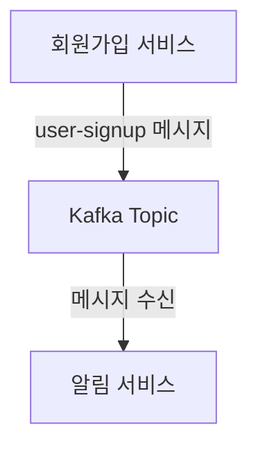

# 이벤트 기반 아키텍처(Event-Driven Architecture)와 Kafka 실전 가이드

## 1. 이벤트 기반 아키텍처란?
- **정의**: 시스템 내에서 발생하는 이벤트(상태 변화, 액션 등)를 중심으로 서비스들이 느슨하게 결합되어 동작하는 아키텍처.
- **특징**: 서비스 간 직접 호출 대신, 이벤트를 발행(Publish)하고 구독(Subscribe)하는 방식으로 통신.
- **장점**:
  - 서비스 간 결합도 감소(독립적 배포/확장 용이)
  - 비동기 처리로 성능 및 확장성 향상
  - 장애 격리 및 복원력 증가

## 2. 서비스 간 비동기 통신의 장점 & Kafka의 적합성
- **비동기 통신 장점**:
  - 요청-응답 지연 감소(즉시 응답 가능)
  - 트래픽 급증 시에도 유연한 처리(버퍼링)
  - 서비스 장애 시에도 메시지 유실 방지(내구성)
- **Kafka가 적합한 이유**:
  - 대용량 이벤트 처리에 최적화(고성능, 고가용성)
  - 메시지 내구성 및 재처리 지원
  - 다양한 소비자 그룹 지원(여러 서비스가 동일 이벤트를 독립적으로 소비)

## 3. Kafka의 구성요소와 기본 동작
- **Producer**: 메시지(이벤트)를 생성하여 Kafka로 전송
- **Consumer**: Kafka에서 메시지를 읽어 처리
- **Topic**: 메시지 분류 단위(이벤트 채널)
- **Broker**: Kafka 서버 인스턴스(여러 대로 클러스터 구성)
- **동작 방식**:
  1. Producer가 특정 Topic에 메시지 발행
  2. Broker가 메시지를 저장(내구성 보장)
  3. Consumer가 Topic을 구독하여 메시지 수신 및 처리

---

# Spring Boot에서 Kafka 사용 예제

## 1. 의존성 추가 (build.gradle)
```groovy
dependencies {
    implementation 'org.springframework.boot:spring-boot-starter'
    implementation 'org.springframework.kafka:spring-kafka'
}
```

## 2. application.yml 예시
```yaml
spring:
  kafka:
    bootstrap-servers: localhost:9092
    consumer:
      group-id: my-group
      auto-offset-reset: earliest
      key-deserializer: org.apache.kafka.common.serialization.StringDeserializer
      value-deserializer: org.apache.kafka.common.serialization.StringDeserializer
    producer:
      key-serializer: org.apache.kafka.common.serialization.StringSerializer
      value-serializer: org.apache.kafka.common.serialization.StringSerializer
```

## 3. Producer 예제
```java
import org.springframework.kafka.core.KafkaTemplate;
import org.springframework.stereotype.Service;

@Service
public class MyProducer {
    private final KafkaTemplate<String, String> kafkaTemplate;

    public MyProducer(KafkaTemplate<String, String> kafkaTemplate) {
        this.kafkaTemplate = kafkaTemplate;
    }

    public void sendMessage(String topic, String message) {
        kafkaTemplate.send(topic, message);
    }
}
```

## 4. Consumer 예제
```java
import org.springframework.kafka.annotation.KafkaListener;
import org.springframework.stereotype.Service;

@Service
public class MyConsumer {
    @KafkaListener(topics = "user-signup", groupId = "my-group")
    public void listen(String message) {
        System.out.println("Received message: " + message);
        // 메시지 처리 로직
    }
}
```

## 5. 실전 예시 흐름
- **유저 회원가입 서비스**: 회원가입 완료 시 `user-signup` 토픽에 메시지 발행
- **알림 서비스**: `user-signup` 토픽을 구독하여, 신규 회원에게 환영 이메일/알림 전송



---

# Kafka와 Redis의 차이 및 실무 활용

## 1. Kafka vs Redis
- **Kafka**: 대용량 이벤트 스트리밍, 내구성 보장, 메시지 재처리/순서 보장, 장기 저장 가능
- **Redis**: 인메모리 캐시, 빠른 데이터 접근, Pub/Sub(간단한 메시지 브로커), 실시간 처리에 강점

## 2. 함께 사용하는 실무 예시
- **Kafka**: 주문, 결제, 회원가입 등 주요 이벤트 스트리밍/비동기 처리
- **Redis**: 세션 캐싱, 실시간 랭킹, 임시 데이터 저장, 빠른 Pub/Sub(알림 등)
- **조합 예시**: Kafka로 이벤트를 수집/처리하고, 처리 결과를 Redis에 캐싱하여 빠른 조회 제공

## 3. Redis Pub/Sub과 Kafka의 차이
- **Redis Pub/Sub**: 메시지 내구성 없음(구독 중인 클라이언트만 수신), 메시지 유실 가능, 단순/실시간 알림에 적합
- **Kafka**: 메시지 내구성/재처리/순서 보장, 대용량 처리, 구독자가 나중에 와도 메시지 수신 가능
- **정리**: Redis Pub/Sub은 단순/실시간 알림, Kafka는 신뢰성/확장성/내구성이 중요한 이벤트 스트리밍에 적합 