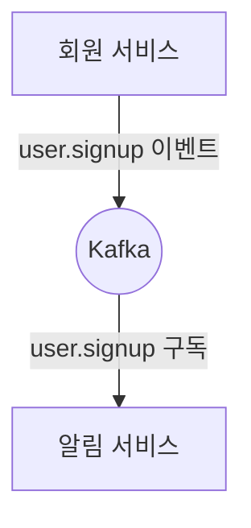
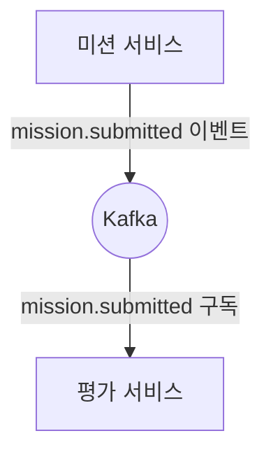
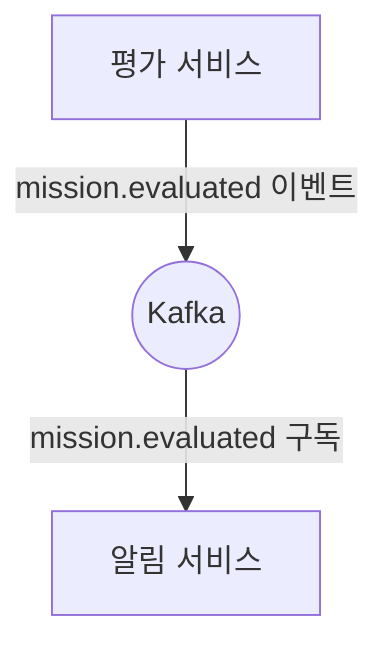

# Kafka 기반 이벤트 기반 아키텍처 예시

Kafka를 활용하면 서비스 간 느슨한 결합과 비동기 처리가 가능한 이벤트 기반 아키텍처를 쉽게 구현할 수 있습니다. 아래는 실무에서 자주 볼 수 있는 흐름별 예시입니다.

---

## 1. 사용자 회원가입 → 알림 서비스
- **회원 서비스**: 회원가입 완료 시 `user.signup` 토픽에 이벤트 발행
- **알림 서비스**: `user.signup` 토픽을 구독하여 환영 이메일/푸시 알림 전송

---

## 2. 미션 제출 → 평가 요청 서비스
- **미션 서비스**: 미션 제출 시 `mission.submitted` 토픽에 이벤트 발행
- **평가 서비스**: `mission.submitted` 토픽을 구독하여 평가 요청 생성

---

## 3. 평가 완료 → 알림 서비스
- **평가 서비스**: 평가 완료 시 `mission.evaluated` 토픽에 이벤트 발행
- **알림 서비스**: `mission.evaluated` 토픽을 구독하여 결과 알림 전송

---

## 4. 서비스 연결 구조 요약
- 각 서비스는 Kafka의 Topic을 통해 이벤트를 발행(Publish)하거나 구독(Subscribe)합니다.
- 서비스 간 직접 호출 없이, Kafka가 이벤트 허브 역할을 하여 느슨한 결합과 확장성을 보장합니다.
- 새로운 서비스가 필요할 때, 기존 서비스 수정 없이 Topic 구독만 추가하면 됩니다.

---

## 5. 실무 적용 팁
- 이벤트 명명 규칙을 일관성 있게 관리(`user.signup`, `mission.submitted` 등)
- 각 서비스는 자신이 필요한 이벤트만 구독하여 독립적으로 동작
- 장애 격리, 확장성, 재처리 등 Kafka의 장점을 최대한 활용 