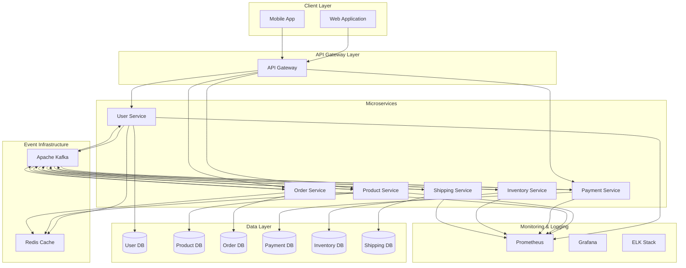
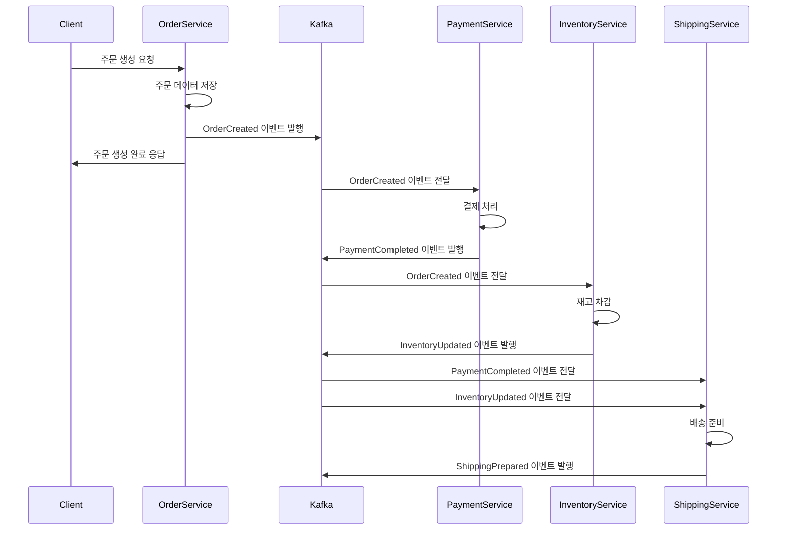

# Event-Driven MSA 설계 및 구현 가이드

## 목차
1. [MSA의 개념 및 설명](#1-msa의-개념-및-설명)
2. [이벤트 기반 아키텍처의 개념 및 설명](#2-이벤트-기반-아키텍처의-개념-및-설명)
3. [설계 방법 및 기본적인 MSA 구조도](#3-설계-방법-및-기본적인-msa-구조도)
4. [설계부터 배포까지의 워크플로우](#4-설계부터-배포까지의-워크플로우)

---

## 1. MSA의 개념 및 설명

### MSA(Microservices Architecture)란?
MSA는 하나의 큰 애플리케이션을 여러 개의 작고 독립적인 서비스로 분해하여 개발하는 아키텍처 패턴.

### 주요 특징
- **독립성**: 각 서비스는 독립적으로 개발, 배포, 확장 가능
- **분산성**: 서비스들이 네트워크를 통해 통신
- **기술 다양성**: 각 서비스마다 다른 기술 스택 사용 가능
- **데이터 분리**: 각 서비스가 자체 데이터베이스 보유

### MSA vs Monolithic 비교
| 구분 | Monolithic | MSA |
|------|------------|-----|
| 배포 | 전체 애플리케이션 | 개별 서비스 |
| 확장성 | 전체 확장 | 필요한 서비스만 확장 |
| 기술 스택 | 단일 기술 | 서비스별 최적 기술 |
| 장애 영향 | 전체 시스템 | 해당 서비스만 |

### MSA의 장점
- **확장성**: 트래픽이 많은 서비스만 선택적 확장
- **기술 자유도**: 서비스별 최적 기술 선택
- **팀 독립성**: 각 팀이 독립적으로 개발
- **장애 격리**: 한 서비스 장애가 전체에 미치는 영향 최소화

### MSA의 단점
- **복잡성 증가**: 분산 시스템의 복잡성
- **네트워크 통신**: 서비스 간 통신 오버헤드
- **데이터 일관성**: 분산 트랜잭션 관리의 어려움
- **운영 복잡도**: 모니터링, 로깅, 배포 관리

---

## 2. 이벤트 기반 아키텍처의 개념 및 설명

### 이벤트 기반 아키텍처(Event-Driven Architecture)란?
서비스 간 통신을 이벤트를 통해 수행하는 아키텍처 패턴으로, 서비스들이 이벤트를 발행(Publish)하고 구독(Subscribe)하여 느슨한 결합을 유지합니다.

### 핵심 개념
- **이벤트(Event)**: 시스템에서 발생한 상태 변화나 중요한 사건
- **이벤트 발행자(Publisher)**: 이벤트를 생성하고 발행하는 서비스
- **이벤트 구독자(Subscriber)**: 이벤트를 수신하고 처리하는 서비스
- **이벤트 브로커(Event Broker)**: 이벤트를 중계하는 미들웨어 (Kafka, RabbitMQ 등)

### 이벤트 기반 통신 패턴

#### 1. Event Notification
```
주문 서비스 → [주문 완료 이벤트] → 재고 서비스, 배송 서비스
```

#### 2. Event-Carried State Transfer
```
사용자 서비스 → [사용자 정보 변경 이벤트 + 전체 데이터] → 다른 서비스들
```

#### 3. Event Sourcing
```
모든 상태 변경을 이벤트로 저장하고, 현재 상태를 이벤트 재생으로 복원
```

### 이벤트 기반 MSA의 장점
- **느슨한 결합**: 서비스 간 직접적인 의존성 제거
- **확장성**: 새로운 서비스 추가가 용이
- **복원력**: 일부 서비스 장애 시에도 이벤트 큐를 통한 복구
- **비동기 처리**: 높은 처리량과 응답성

### 이벤트 기반 MSA의 단점
- **복잡성**: 이벤트 순서, 중복 처리 등 고려사항 증가
- **디버깅 어려움**: 분산된 이벤트 플로우 추적의 복잡성
- **최종 일관성**: 즉시 일관성 보장 어려움

---

## 3. 설계 방법 및 기본적인 MSA 구조도

### 도메인 주도 설계(DDD) 기반 서비스 분리

#### 1. 도메인 식별
```
전자상거래 시스템 예시:
- 사용자 관리 (User Management)
- 상품 관리 (Product Management)  
- 주문 관리 (Order Management)
- 결제 처리 (Payment Processing)
- 재고 관리 (Inventory Management)
- 배송 관리 (Shipping Management)
```

#### 2. 바운디드 컨텍스트 정의
각 도메인의 경계를 명확히 하고, 서비스 간 인터페이스를 정의합니다.

### 기본적인 Event-Driven MSA 구조도



### 이벤트 플로우 예시



### 서비스 설계 원칙

#### 1. Single Responsibility Principle
각 서비스는 하나의 비즈니스 기능에만 집중

#### 2. Database per Service
각 서비스는 자체 데이터베이스를 가져야 함

#### 3. Decentralized Governance
각 팀이 자체 서비스의 기술 스택과 배포를 결정

#### 4. Failure Isolation
한 서비스의 장애가 다른 서비스에 영향을 주지 않도록 설계

---

## 4. 설계부터 배포까지의 워크플로우

### Phase 1: 요구사항 분석 및 설계

#### 1.1 비즈니스 요구사항 분석
```
- 기능 요구사항 정의
- 비기능 요구사항 정의 (성능, 확장성, 가용성)
- 사용자 스토리 작성
```

#### 1.2 도메인 모델링
```
- 도메인 전문가와 협업
- 바운디드 컨텍스트 식별
- 도메인 이벤트 정의
- 애그리게이트 설계
```

#### 1.3 서비스 분해
```
- DDD 기반 서비스 경계 설정
- 서비스 간 통신 방식 결정
- 이벤트 스키마 설계
- API 계약 정의
```

### Phase 2: 기술 스택 선택

#### 2.1 개발 기술 스택
```
Backend Framework:
- Java: Spring Boot + Spring Cloud
- Node.js: Express.js + NestJS
- Python: FastAPI + Django
- Go: Gin + Echo

Database:
- RDBMS: PostgreSQL, MySQL
- NoSQL: MongoDB, Cassandra
- Cache: Redis, Memcached

Message Broker:
- Apache Kafka (권장)
- RabbitMQ
- Apache Pulsar
```

#### 2.2 인프라 기술 스택
```
Container: Docker
Orchestration: Kubernetes
Service Mesh: Istio (선택사항)
API Gateway: Kong, Zuul, Spring Cloud Gateway
Monitoring: Prometheus + Grafana
Logging: ELK Stack (Elasticsearch, Logstash, Kibana)
Tracing: Jaeger, Zipkin
```

### Phase 3: 개발 환경 구성

#### 3.1 로컬 개발 환경
```bash
# Docker Compose로 로컬 인프라 구성
version: '3.8'
services:
  zookeeper:
    image: confluentinc/cp-zookeeper:latest
    environment:
      ZOOKEEPER_CLIENT_PORT: 2181
      
  kafka:
    image: confluentinc/cp-kafka:latest
    depends_on:
      - zookeeper
    environment:
      KAFKA_BROKER_ID: 1
      KAFKA_ZOOKEEPER_CONNECT: zookeeper:2181
      KAFKA_ADVERTISED_LISTENERS: PLAINTEXT://localhost:9092
      
  redis:
    image: redis:alpine
    ports:
      - "6379:6379"
      
  postgres:
    image: postgres:13
    environment:
      POSTGRES_DB: microservices
      POSTGRES_USER: admin
      POSTGRES_PASSWORD: password
```

#### 3.2 개발 도구 설정
```
IDE: IntelliJ IDEA, VS Code
API 테스팅: Postman, Insomnia
Database 관리: DBeaver, pgAdmin
Container 관리: Docker Desktop
```

### Phase 4: 서비스 구현

#### 4.1 서비스 템플릿 생성
```java
// Spring Boot 기반 마이크로서비스 예시
@SpringBootApplication
@EnableJpaRepositories
@EnableKafka
public class OrderServiceApplication {
    public static void main(String[] args) {
        SpringApplication.run(OrderServiceApplication.class, args);
    }
}

@RestController
@RequestMapping("/api/orders")
public class OrderController {
    
    @Autowired
    private OrderService orderService;
    
    @PostMapping
    public ResponseEntity<OrderResponse> createOrder(@RequestBody CreateOrderRequest request) {
        OrderResponse response = orderService.createOrder(request);
        return ResponseEntity.ok(response);
    }
}

@Service
@Transactional
public class OrderService {
    
    @Autowired
    private OrderRepository orderRepository;
    
    @Autowired
    private EventPublisher eventPublisher;
    
    public OrderResponse createOrder(CreateOrderRequest request) {
        Order order = new Order(request);
        order = orderRepository.save(order);
        
        // 이벤트 발행
        OrderCreatedEvent event = new OrderCreatedEvent(order);
        eventPublisher.publish("order-events", event);
        
        return new OrderResponse(order);
    }
}
```

#### 4.2 이벤트 처리 구현
```java
@Component
public class OrderEventHandler {
    
    @KafkaListener(topics = "payment-events")
    public void handlePaymentCompleted(PaymentCompletedEvent event) {
        // 결제 완료 이벤트 처리 로직
        log.info("Payment completed for order: {}", event.getOrderId());
    }
}
```

### Phase 5: 테스팅

#### 5.1 단위 테스트
```java
@ExtendWith(MockitoExtension.class)
class OrderServiceTest {
    
    @Mock
    private OrderRepository orderRepository;
    
    @Mock
    private EventPublisher eventPublisher;
    
    @InjectMocks
    private OrderService orderService;
    
    @Test
    void shouldCreateOrderSuccessfully() {
        // Given
        CreateOrderRequest request = new CreateOrderRequest();
        Order savedOrder = new Order();
        when(orderRepository.save(any(Order.class))).thenReturn(savedOrder);
        
        // When
        OrderResponse response = orderService.createOrder(request);
        
        // Then
        assertThat(response).isNotNull();
        verify(eventPublisher).publish(eq("order-events"), any(OrderCreatedEvent.class));
    }
}
```

#### 5.2 통합 테스트
```java
@SpringBootTest
@Testcontainers
class OrderServiceIntegrationTest {
    
    @Container
    static PostgreSQLContainer<?> postgres = new PostgreSQLContainer<>("postgres:13")
            .withDatabaseName("testdb")
            .withUsername("test")
            .withPassword("test");
    
    @Container
    static KafkaContainer kafka = new KafkaContainer(DockerImageName.parse("confluentinc/cp-kafka:latest"));
    
    @Test
    void shouldProcessOrderCreationFlow() {
        // 전체 플로우 테스트
    }
}
```

#### 5.3 계약 테스트 (Contract Testing)
```java
// Pact를 사용한 계약 테스트
@ExtendWith(PactConsumerTestExt.class)
@PactTestFor(providerName = "payment-service")
class OrderServiceContractTest {
    
    @Pact(consumer = "order-service")
    public RequestResponsePact createPaymentPact(PactDslWithProvider builder) {
        return builder
                .given("payment service is available")
                .uponReceiving("a request to process payment")
                .path("/api/payments")
                .method("POST")
                .willRespondWith()
                .status(200)
                .body(LambdaDsl.newJsonBody(body -> body.stringType("paymentId", "12345")).build())
                .toPact();
    }
}
```

### Phase 6: CI/CD 파이프라인 구성

#### 6.1 GitHub Actions 워크플로우
```yaml
name: CI/CD Pipeline

on:
  push:
    branches: [ main, develop ]
  pull_request:
    branches: [ main ]

jobs:
  test:
    runs-on: ubuntu-latest
    steps:
    - uses: actions/checkout@v3
    
    - name: Set up JDK 17
      uses: actions/setup-java@v3
      with:
        java-version: '17'
        distribution: 'temurin'
        
    - name: Run tests
      run: ./gradlew test
      
    - name: Run integration tests
      run: ./gradlew integrationTest
      
  build:
    needs: test
    runs-on: ubuntu-latest
    steps:
    - uses: actions/checkout@v3
    
    - name: Build Docker image
      run: |
        docker build -t order-service:${{ github.sha }} .
        docker tag order-service:${{ github.sha }} order-service:latest
        
    - name: Push to registry
      run: |
        echo ${{ secrets.DOCKER_PASSWORD }} | docker login -u ${{ secrets.DOCKER_USERNAME }} --password-stdin
        docker push order-service:${{ github.sha }}
        docker push order-service:latest
        
  deploy:
    needs: build
    runs-on: ubuntu-latest
    if: github.ref == 'refs/heads/main'
    steps:
    - name: Deploy to Kubernetes
      run: |
        kubectl set image deployment/order-service order-service=order-service:${{ github.sha }}
        kubectl rollout status deployment/order-service
```

#### 6.2 Dockerfile 작성
```dockerfile
FROM openjdk:17-jre-slim

WORKDIR /app

COPY build/libs/order-service-*.jar app.jar

EXPOSE 8080

HEALTHCHECK --interval=30s --timeout=3s --start-period=5s --retries=3 \
  CMD curl -f http://localhost:8080/actuator/health || exit 1

ENTRYPOINT ["java", "-jar", "app.jar"]
```

### Phase 7: 배포 및 운영

#### 7.1 Kubernetes 배포 매니페스트
```yaml
apiVersion: apps/v1
kind: Deployment
metadata:
  name: order-service
spec:
  replicas: 3
  selector:
    matchLabels:
      app: order-service
  template:
    metadata:
      labels:
        app: order-service
    spec:
      containers:
      - name: order-service
        image: order-service:latest
        ports:
        - containerPort: 8080
        env:
        - name: SPRING_PROFILES_ACTIVE
          value: "production"
        - name: KAFKA_BOOTSTRAP_SERVERS
          value: "kafka:9092"
        resources:
          requests:
            memory: "256Mi"
            cpu: "250m"
          limits:
            memory: "512Mi"
            cpu: "500m"
        livenessProbe:
          httpGet:
            path: /actuator/health
            port: 8080
          initialDelaySeconds: 30
          periodSeconds: 10
        readinessProbe:
          httpGet:
            path: /actuator/health/readiness
            port: 8080
          initialDelaySeconds: 5
          periodSeconds: 5
---
apiVersion: v1
kind: Service
metadata:
  name: order-service
spec:
  selector:
    app: order-service
  ports:
  - protocol: TCP
    port: 80
    targetPort: 8080
  type: ClusterIP
```

#### 7.2 모니터링 설정
```yaml
# Prometheus 설정
apiVersion: monitoring.coreos.com/v1
kind: ServiceMonitor
metadata:
  name: order-service-monitor
spec:
  selector:
    matchLabels:
      app: order-service
  endpoints:
  - port: http
    path: /actuator/prometheus
```

#### 7.3 로깅 설정
```yaml
# application.yml
logging:
  level:
    com.example.orderservice: INFO
  pattern:
    console: "%d{yyyy-MM-dd HH:mm:ss} [%thread] %-5level [%X{traceId},%X{spanId}] %logger{36} - %msg%n"
    
management:
  endpoints:
    web:
      exposure:
        include: health,info,metrics,prometheus
  endpoint:
    health:
      show-details: always
  metrics:
    export:
      prometheus:
        enabled: true
```

### Phase 8: 운영 및 모니터링

#### 8.1 핵심 메트릭 모니터링
```
- 응답 시간 (Response Time)
- 처리량 (Throughput)  
- 에러율 (Error Rate)
- 가용성 (Availability)
- 리소스 사용률 (CPU, Memory, Disk)
- 이벤트 처리 지연 (Event Processing Lag)
```

#### 8.2 알림 설정
```yaml
# Prometheus Alert Rules
groups:
- name: order-service-alerts
  rules:
  - alert: HighErrorRate
    expr: rate(http_requests_total{status=~"5.."}[5m]) > 0.1
    for: 2m
    labels:
      severity: critical
    annotations:
      summary: "High error rate detected in order service"
      
  - alert: HighResponseTime
    expr: histogram_quantile(0.95, rate(http_request_duration_seconds_bucket[5m])) > 1
    for: 5m
    labels:
      severity: warning
    annotations:
      summary: "High response time detected in order service"
```

#### 8.3 장애 대응 절차
```
1. 알림 수신 및 초기 대응
2. 로그 및 메트릭 분석
3. 장애 원인 파악
4. 임시 조치 (서킷 브레이커, 트래픽 제한 등)
5. 근본 원인 해결
6. 사후 분석 및 개선사항 도출
```

### 개발 팀을 위한 실무 팁

#### 1. 점진적 마이그레이션
```
Monolith → MSA 전환 시:
1. Strangler Fig 패턴 사용
2. 가장 독립적인 기능부터 분리
3. 데이터베이스는 마지막에 분리
```

#### 2. 이벤트 설계 원칙
```
- 이벤트는 과거형으로 명명 (OrderCreated, PaymentCompleted)
- 이벤트에는 충분한 컨텍스트 정보 포함
- 이벤트 스키마 버전 관리
- 멱등성 보장 (같은 이벤트 중복 처리 시 결과 동일)
```

#### 3. 성능 최적화
```
- 이벤트 배치 처리
- 적절한 파티셔닝 전략
- 캐싱 전략 수립
- 데이터베이스 커넥션 풀 최적화
```

---